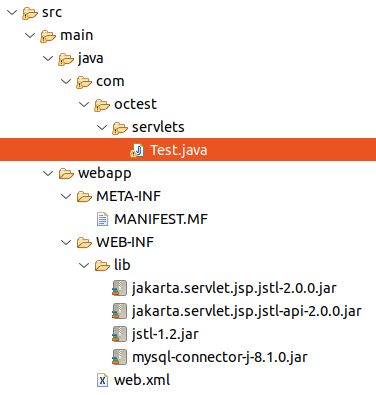
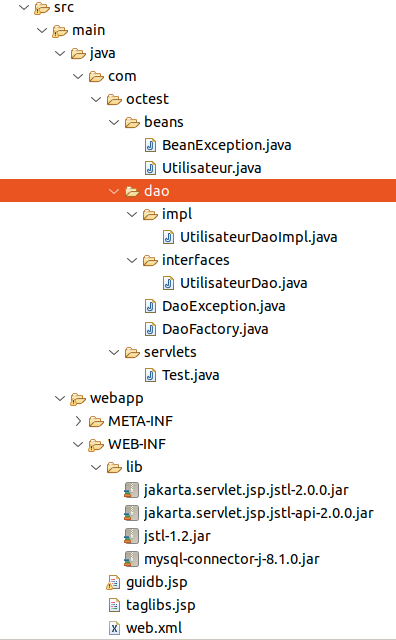

## Étude du cours "Développez des sites web avec Java EE" de Mathieu Nebra sur openclassrooms.com pour développer une application web proposant les services de lecture et d'écriture dans une table d'une base de données MySQL tout en respectant MVC et DAO

Le [cours "Développez des sites web avec Java EE"](https://openclassrooms.com/fr/courses/2434016-developpez-des-sites-web-avec-java-ee) sur [openclassrooms.com](https://openclassrooms.com/fr/) a été étudié.

### Création d'une application web
- Navigation: `file → new → dynamic web project → Project name: test_DAO`

### Gestion des dépendances tierces
- Copier les bibliothèques dans `src/main/webapp/WEB-INF/lib/` puis dans le menu `Build Path → Configure Build Path → Classpath → Add JARs`.

### Ajout d'un servlet
Pour ajouter un servlet, suivez ces étapes :
1. `Java Resources → new → servlet → Java package: com.oc<domain name level 2>.servlets → Class name: <servlet name>` 

4. Configuration dans `WEB-INF → New → Other → filter: xml → XML File → Next → File name: web.xml` avec le contenu XML pour définir la servlet et son mappage.
```xml
<?xml version="1.0" encoding="UTF-8"?>
<web-app xmlns:xsi="http://www.w3.org/2001/XMLSchema-instance" 
         xmlns="https://jakarta.ee/xml/ns/jakartaee" 
         xsi:schemaLocation="https://jakarta.ee/xml/ns/jakartaee https://jakarta.ee/xml/ns/jakartaee/web-app_6_0.xsd" 
         version="6.0">
    <servlet>
        <servlet-name>Test</servlet-name>
        <servlet-class>com.octest.servlets.Test</servlet-class>
    </servlet>
    <servlet-mapping>
        <servlet-name>Test</servlet-name>
        <url-pattern>/guidb</url-pattern>
    </servlet-mapping>
</web-app>
```

### Création d'une vue
Pour créer une vue, suivez ces étapes :
1. `WEB-INF → New → JSP File → File name: guidb.jsp`
   ```jsp
   <%@ page language="java" contentType="text/html; charset=UTF-8"
       pageEncoding="UTF-8"%>
   <!DOCTYPE html>
   <html>
   <head>
   <meta charset="UTF-8">
   <title>Test_DAO</title>
   </head>
   <body>
       <p>
           Pense-bête pour commencer un dynamic web project avec GUI pour écrire et lire dans une table d'une base 
           de données MySQL tout en respectant MVC et DAO
       </p>
   </body>
   </html>
   ```

### Implémentation de la méthode doGet du servlet pour associer la vue au servlet pour la méthode GET

```java
protected void doGet(HttpServletRequest request, HttpServletResponse response) throws ServletException, IOException {
    this.getServletContext().getRequestDispatcher("/WEB-INF/guidb.jsp").forward(request, response);
    /*
     * L'objet ServletContext récupéré par la méthode getServletContext() héritée de la classe HttpServlet est destiné
     * à contenir des informations relatives à l'exécution de l'application web. Cependant, il est important de noter que
     * ServletContext existe en une seule instance par application web (par contexte d'application) et est partagé par toutes
     * les servlets au sein de cette application.
     *
     * ServletContext donne à la servlet la capacité de communiquer avec son "environnement extérieur" en lui fournissant
     * un moyen d'accéder à des informations globales (comme des paramètres de configuration) et des ressources (comme des
     * objets stockés dans le contexte), et non pas seulement celles dont elle a spécifiquement besoin de connaître. Cela
     * signifie que ServletContext permet à la servlet d'interagir avec un large éventail de données qui concernent l'ensemble
     * de l'application, pas seulement celles propres à une instance de servlet.
     *
     * En résumé, ServletContext est un objet qui représente l'environnement de l'application web au sein du serveur (comme
     * Tomcat) et fournit un moyen de partager des informations entre toutes les parties de l'application, garantissant ainsi
     * un accès cohérent et centralisé aux données importantes de l'application.
     *
     * getRequestDispatcher("/WEB-INF/guidb.jsp") récupère une instance de classe RequestDispatcher associée à la vue
     * /WEB-INF/guidb.jsp
     *
     * (NOTION DE CONTENEUR)
     * L'objet RequestDispatcher agit comme un wrapper ou un conteneur pour la ressource que l'on souhaite atteindre.
     * Lorsqu'on appelle la méthode forward(request, response) sur cet objet, il utilise les objets HttpServletRequest
     * et HttpServletResponse que l'on lui passe pour déléguer la requête et la réponse à la ressource JSP spécifiée.
     * La JSP peut alors générer du contenu dynamique qui sera renvoyé au client, comme si ce contenu avait été généré
     * par le servlet lui-même.
     *
     * (FLUX DE CONTRÔLE)
     * Il est important de noter que, pendant l'opération de transfert (forward), la requête et la réponse ne sont pas
     * réinitialisées ou modifiées par le conteneur de servlet avant d'être passées à la ressource cible. Ainsi, toutes
     * les données ou objets qui ont été ajoutés à la requête restent disponibles pour la ressource JSP.
     *
     * (RESPECT DU PATRON DE CONCEPTION MVC)
     * objet RequestDispatcher obtenu par getRequestDispatcher("/WEB-INF/guidb.jsp") est un mécanisme qui permet à la
     * servlet de déléguer la réponse à une requête à une page JSP spécifique pour le rendu de la vue, tout en gardant la
     * logique de traitement de la requête au sein du servlet.
     */
}
```

### Installation de la JSTL (Java server page Standard Tag Library)

- Copier `jstl-1.2.jar`, `jakarta.servlet.jsp.jstl-2.0.0.jar` et `jakarta.servlet.jsp.jstl-api-2.0.0.jar` puis "Add Jars" (déjà fait ; voir plus haut).
- Créez un autre fichier .jsp nommé `taglibs.jsp` destiné à être inclus dans les autres .jsp pour interpréter les balises JSTL (et pour l'encodage) :

```jsp
<%@ page pageEncoding="UTF-8" %>
<%@ taglib uri="http://java.sun.com/jsp/jstl/core" prefix="c" %>
```

- Configuration dans `web.xml` pour inclure `taglibs.jsp` en prélude dans tous les fichiers .jsp :

```xml
<?xml version="1.0" encoding="UTF-8"?>
<web-app 
    xmlns:xsi="http://www.w3.org/2001/XMLSchema-instance" 
    xmlns="https://jakarta.ee/xml/ns/jakartaee" 
    xsi:schemaLocation="https://jakarta.ee/xml/ns/jakartaee https://jakarta.ee/xml/ns/jakartaee/web-app_6_0.xsd" 
    version="6.0">

    <!-- VOIR PRÉCÉDEMMENT POUR LE DÉBUT DE L'IMPLÉMENTATION -->    
        
    <!-- inclusion de taglibs.jsp en prélude de tous les fichiers .jsp -->
    <jsp-config>
        <jsp-property-group>
            <url-pattern>*.jsp</url-pattern>
            <include-prelude>/WEB-INF/taglibs.jsp</include-prelude>
        </jsp-property-group>
    </jsp-config>

</web-app>
```

### Création d'une base de données "jakartaee" et une table "noms" dans cette base via le serveur MySQL

```sh
mysql -h localhost -u root -p
CREATE DATABASE jakartaee default character set utf8 collate utf8_general_ci;
USE jakartaee;
CREATE TABLE  noms (
 id INT( 11 ) NOT NULL AUTO_INCREMENT ,
 nom VARCHAR( 200 ) NOT NULL ,
 prenom VARCHAR( 200 ) NOT NULL ,
 PRIMARY KEY ( id )
) ENGINE = INNODB;
INSERT INTO noms(nom, prenom) VALUES("Dupont", "Jean");
INSERT INTO noms(nom, prenom) VALUES("La Police", "Léo");
QUIT;
```

### Installation de JDBC (Java Data Base Connectivity)

Copier mysql-connector-j-8.1.0.jar puis "Add Jars" (déjà fait ; voir plus haut)

### Implémentation respectant le patron de conception DAO (Data Access Objet)

- **Implémentation de la classe DaoFactory** servant d'intermédiaire entre le modèle
  et la base de données ; cette classe ne peut générer qu'une seule instance (ie son
  implémentation respecte le pattern singleton). Cette unique instance possède une
  méthode `getConnection()` chargée d'établir une connexion avec la base de données et
  de retourner une instance de classe `Connection` gérant les données relatives à
  cette connexion. Cette unique instance de `DaoFactory` possède aussi des méthodes
  retournant des instances d'objets `TrucDaoImpl` implémentant les interfaces
  correspondant chacune à une couche de services chargée d'interagir avec l'une des
  tables de la base de données (qui correspond à une entité) ; par exemple,
  `getUtilisateurDao()` retourne une instance de la classe `UtilisateurDaoImpl`
  implémentant l'interface `UtilisateurDao`, cette dernière instance connaissant
  l'unique instance de DaoFactory, elle peut établir des connexion avec la base de
  données et faire notamment des opérations sur la table "noms" et ses méthodes
  fournissent une couche de services pour interagir avec cette table ; elle peut aussi
  créer éventuellement d'autres instances fournissant de façon analogue des couches de
  services pour interagir avec d'autres tables de la base de données.

```java
package com.octest.dao;

import java.sql.Connection;
import java.sql.DriverManager;
import java.sql.SQLException;
import com.octest.dao.interfaces.UtilisateurDao;
import com.octest.dao.impl.UtilisateurDaoImpl;

public class DaoFactory {
    private String url;
    private String username;
    private String password;
    
    // Instance statique privée (utile pour respecter le pattern Singleton)
    private static DaoFactory instance;
    
    private DaoFactory(String url, String username, String password) {
        this.url = url;
        this.username = username;
        this.password = password;
    }
    
    public static DaoFactory getInstance() {
        if (instance == null) { // pour respecter le pattern Singleton
            try {
                Class.forName("com.mysql.cj.jdbc.Driver");
                instance = new DaoFactory(
                        "jdbc:mysql://localhost:3306/jakartaee",
                        "root",
                        "███████████" );
            } catch (ClassNotFoundException e) {
                
            }
        }
        return instance;
    }
    
    public Connection getConnection() throws SQLException {
        Connection connexion = DriverManager.getConnection(url, username, password);
        connexion.setAutoCommit(false);
        return connexion;
    }
    
    // récupération du Dao
    public UtilisateurDao getUtilisateurDao() {
        return new UtilisateurDaoImpl(this);
    }
}
```

- **Implémentation de l'interface UtilisateurDao** spécifiant la couche de services nécessaire pour interagir avec la table "noms" stockant et organisant les données relatives aux utilisateurs.

```java
package com.octest.dao.interfaces;

import java.util.List;
import com.octest.beans.Utilisateur;
import com.octest.dao.DaoException;

public interface UtilisateurDao {
    void ajouter(Utilisateur utilisateur) throws DaoException;
    List<Utilisateur> lister() throws DaoException;
}
```

- **Implémentation de la classe UtilisateurDaoImpl** dont les instances fournissent une couche de services nécessaire pour interagir avec la table "noms" stockant et organisant les données relatives aux utilisateurs.

```java
package com.octest.dao.impl;

import java.sql.*;
import java.util.ArrayList;
import java.util.List;

import com.octest.dao.DaoFactory;
import com.octest.dao.interfaces.UtilisateurDao;
import com.octest.beans.BeanException;
import com.octest.dao.DaoException;
import com.octest.beans.Utilisateur;

public class UtilisateurDaoImpl implements UtilisateurDao {
    private DaoFactory daoFactory;
    
    public UtilisateurDaoImpl(DaoFactory daoFactory) {
        this.daoFactory = daoFactory;
    }
    
    @Override
    public void ajouter(Utilisateur utilisateur) throws DaoException {
        Connection connexion = null;
        PreparedStatement preparedStatement = null;
        try {
            connexion = daoFactory.getConnection();
            preparedStatement = connexion.prepareStatement("INSERT INTO noms(nom, prenom) VALUES(?, ?);");
            preparedStatement.setString(1, utilisateur.getNom());
            preparedStatement.setString(2, utilisateur.getPrenom());
            preparedStatement.executeUpdate();
            connexion.commit();
        } catch (SQLException e) {
            try {
                if (connexion != null) {
                    connexion.rollback();
                }
            } catch (SQLException e2) {
            }
            throw new DaoException("Impossible de communiquer avec la base de données.");
        } finally {
            try {
                if (connexion != null) {
                    connexion.close();
                }
            } catch (SQLException e) {
                throw new DaoException("Impossible de communiquer avec la base de données.");
            }
        }
    }
    
    @Override
    public List<Utilisateur> lister() throws DaoException {
        List<Utilisateur> utilisateurs = new ArrayList<Utilisateur>();
        Connection connexion = null;
        Statement statement = null;
        ResultSet resultat = null;
        try {
            connexion = daoFactory.getConnection();
            statement = connexion.createStatement();
            resultat = statement.executeQuery("SELECT nom, prenom FROM noms;");
            while (resultat.next()) {
                utilisateurs.add(new Utilisateur(resultat.getString("nom"), resultat.getString("prenom")));
            }
        } catch (SQLException e) {
            throw new DaoException("Impossible de communiquer avec la base de données.");
        } catch (BeanException e) {
            throw new DaoException("Les données de la base sont invalides.");
        } finally {
            try {
                if (connexion != null) {
                    connexion.close();
                }
            } catch (SQLException e) {
                throw new DaoException("Impossible de communiquer avec la base de données.");
            }
        }
        return utilisateurs;
    }
}
```

- Packages relatifs au DAO :
  

- Implémentation des méthodes du servlet pour lire et écrire dans la table via une couche de services fournie par DaoFactory et UtilisateurDaoImpl; le servlet écrit dans la table les données récupérées via la méthode POST dans des variables d'identifiants "nom" et "prenom" et il transmet à la vue une liste "utilisateurs" d'instances de classe Utilisateur stockant et organisant les données lues dans la table :

```java
package com.octest.servlets;

import jakarta.servlet.ServletException;
import jakarta.servlet.annotation.WebServlet;
import jakarta.servlet.http.HttpServlet;
import jakarta.servlet.http.HttpServletRequest;
import jakarta.servlet.http.HttpServletResponse;
import java.io.IOException;

import com.octest.beans.Utilisateur;
import com.octest.dao.DaoException;
import com.octest.dao.DaoFactory;
import com.octest.dao.interfaces.UtilisateurDao;

@WebServlet("/Test_DAO")
public class Test extends HttpServlet {
    
    private static final long serialVersionUID = 1L;
    private UtilisateurDao utilisateurDao;
    
    public void init() throws ServletException {
        // génération d'une couche de services pour interagir avec la table noms suivant DAO
        DaoFactory daoFactory = DaoFactory.getInstance();
        this.utilisateurDao = daoFactory.getUtilisateurDao();
    }

    protected void doGet(HttpServletRequest request, HttpServletResponse response) throws ServletException, IOException {

        // transmission des données à la vue
        try {
            request.setAttribute("utilisateurs", this.utilisateurDao.lister());
        } catch (DaoException e) {
            request.setAttribute("erreur", e.getMessage());
        }
        
        this.getServletContext().getRequestDispatcher("/WEB-INF/guidb.jsp").forward(request, response);
        
    }

    protected void doPost(HttpServletRequest request, HttpServletResponse response) throws ServletException, IOException {
        
        // enregistrement des informations soumises via la méthode POST suivant DAO
        try {
            utilisateurDao.ajouter(new Utilisateur(request.getParameter("nom"), request.getParameter("prenom")));
        } catch (Exception e) {
            request.setAttribute("erreur", e.getMessage());
        }
        
        // transmission des données à la vue
        try {
            request.setAttribute("utilisateurs", utilisateurDao.lister());
        } catch (DaoException e) {
            request.setAttribute("erreur", e.getMessage());
        }
        
        this.getServletContext().getRequestDispatcher("/WEB-INF/guidb.jsp").forward(request, response);
    }

}
```

### Implémentation de la vue guidb.jsp

- Pour afficher les données de la table envoyées par le servlet via la liste
  "utilisateurs" d'instances de classe Utilisateur stockant et organisant les données
  lues dans la table ;

- Pour envoyer au servlet des données soumises par le client via un formulaire avec
  la méthode POST dans les paramètres "nom" et "prenom" afin que ce-dernier enregistre
  dans la table la nouvelle entrée correspondante via une couche de services fournie
  par DaoFactory et UtilisateurDaoImpl.


```jsp
<!DOCTYPE html>
<html>
<head>
<meta charset="UTF-8">
<title>Test_DAO</title>
</head>
<body>
    <p>
        Pense-bête pour commencer un dynamic web project avec GUI pour écrire 
        et lire dans une table d'une base de données MySQL tout en respectant 
        MVC et DAO
    </p>
    <c:choose>
        <c:when test="${ !empty erreur }">
            <p style="color: red">
                Erreur : <c:out value="${ erreur }" />
            </p>
        </c:when>
        <c:otherwise>
            <p>
                Lecture de la table :
            </p>
            <ul>
                <c:forEach var="utilisateur" items="${ utilisateurs }">
                    <li>
                        <c:out value="${ utilisateur.getPrenom() } " />
                        <c:out value="${ utilisateur.getNom() } " />
                    </li>
                </c:forEach>
            </ul>
            <p>
                Ajouter une entrée dans la table :
            </p>    
            <form method="post" action="guidb">
                <label for="nom">Nom :</label>
                <input type="text" id="nom" name="nom" />
                <label for="prenom">Prénom :</label>
                <input type="text" id="prenom" name="prenom" />
                <input type="submit">
            </form>
        </c:otherwise>
    </c:choose>
</body>
</html>
```

### Gestion des erreurs
(déjà implémenté)
- **com.octest.beans.BeanException.java**

```java
package com.octest.beans;

public class BeanException extends Exception {
    private static final long serialVersionUID = 1L;

    public BeanException(String message) {
        super(message);
    }
}
```

- **com.octest.dao.DaoException**

```java
package com.octest.dao;

public class DaoException extends Exception {
    private static final long serialVersionUID = 1L;

    public DaoException(String message) {
        super(message);
    }
}
```

### Gestion des transactions
(déjà fait)  
Utilisation de `connexion.setAutoCommit(false);`, `connexion.commit();`, et `connexion.rollback();` pour gérer les transactions.

