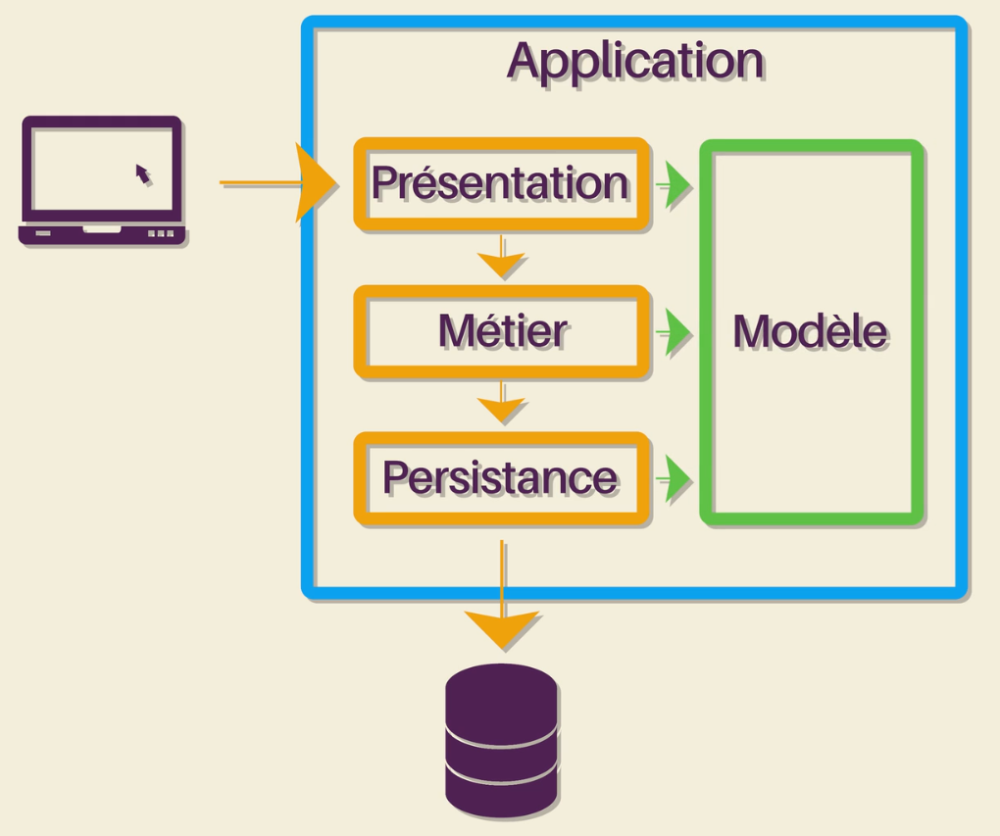
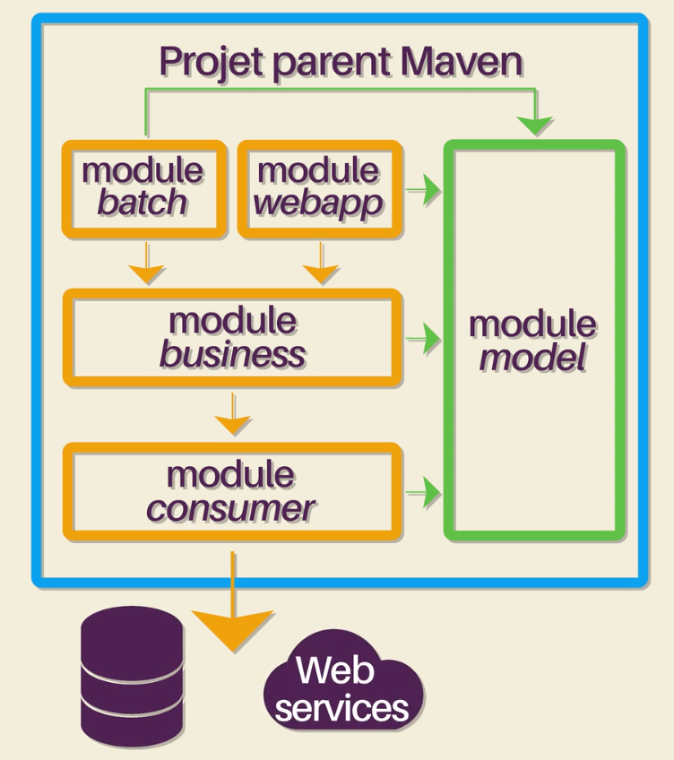
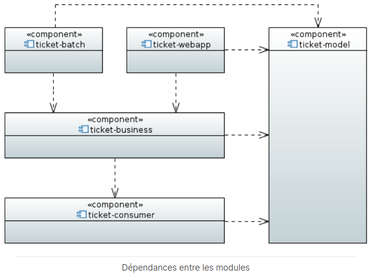
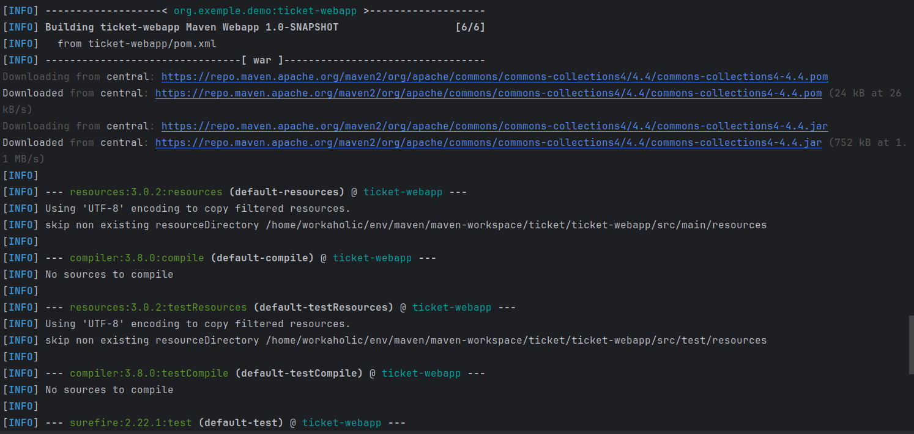
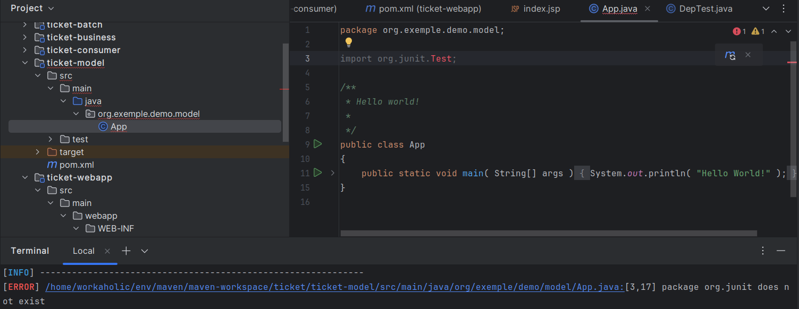
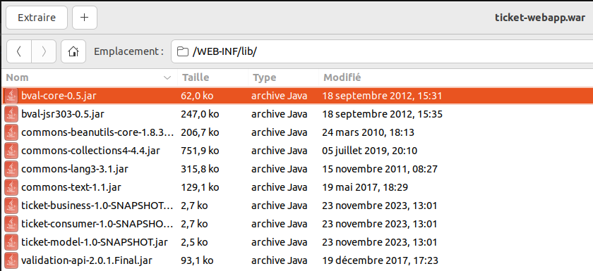

## Étude du cours "Organiser et packager une application Java avec Apache Maven" de Loïc Guibert sur openclassrooms.com

lien du cours étudié : [cours "Organisez et packagez une application Java avec Apache Maven"](https://openclassrooms.com/fr/courses/4503526-organisez-et-packagez-une-application-java-avec-apache-maven) sur [openclassrooms.com](https://openclassrooms.com/fr/)

### Étapes

#### Création d'un répertoire env/ pour l'environnement de développement
On construit un répertoire de développement comme expliqué dans la section "Construction de l'environnement de développement" :
```
env
├── current-workspace -> maven/maven-workspace
├── eclipse
│   ├── current -> eclipse-jee-2023-09-R
│   ├── eclipse-jee-2023-09-R
│   └── eclipse-workspace
│       ├── JEU-PUISSANCE-4
│       ├── Servers
│       └── test_DAO
├── env_config
│   ├── bashrc
│   ├── env_config.txt
├── intellij
│   ├── current -> /home/workaholic/env/intellij/idea-IC-232.10227.8
│   ├── idea-IC-232.10227.8
│   ├── idea-IU-232.10227.8
│   └── intellij-workspace
├── java
│   ├── current -> jdk-21.0.1
│   └── jdk-21.0.1
├── maven
│   ├── apache-maven-3.9.5
│   ├── current -> apache-maven-3.9.5
│   └── maven-workspace
│       ├── activite-p2
│       ├── mon-appli
│       ├── oc-testing-java-cours
│       ├── test_DAO
│       ├── ticket
│       └── ticket-du-cours-openclassroom
├── sgbdr
│   └── mysql
│       ├── current-client -> /home/workaholic/env/sgbdr/mysql/mysql_8.2.0/usr/bin/mysql
│       ├── current-server -> /home/workaholic/env/sgbdr/mysql/mysql_8.2.0/usr/sbin/mysqld
│       └── mysql_8.2.0
└── tomcat
    ├── apache-tomcat-10.1.16
    │   ├── bin
    │   │   ├── [...]
    │   │   ├── catalina.sh
    │   │   ├── [...]
    │   │   ├── shutdown.sh
    │   │   ├── [...]
    │   │   ├── startup.sh
    │   │   ├── [...]
    │   ├── [...]
    │   ├── conf
    │   │   ├── [...]
    │   ├── CONTRIBUTING.md
    │   ├── lib
    │   ├── logs
    │   │   ├── catalina.2024-01-14.log
    │   │   ├── [...]
    │   │   ├── catalina.out
    │   │   ├── localhost.2024-01-14.log
    │   │   ├── [...]
    │   │   ├── localhost_access_log.2023-11-26.txt
    │   │   ├── [...]
    │   │   └── manager.2024-03-11.log
    │   ├── [...]
    │   ├── webapps
    │   │   ├── ticket-webapp.war
    │   └── [...]
    ├── current -> apache-tomcat-10.1.16
    └── var
        └── log
            └── onlineplay.log
```

### Création d'un projet maven respectant la version 1.1 de l'archétype maven-archetype-quickstart
- de `groupId` org.exemple.demo (l'organisation qui porte le projet)
- de `artifactId` mon-appli (le nom du projet)
- de `version` 1.0-SNAPSHOT (proposée par défaut)

Remarque : Par convention Maven, le suffixe SNAPSHOT indique que le code de la version n'est pas figé. Par opposition, si la version ne se termine pas par le suffixe -SNAPSHOT, cela signifie qu'il s'agit d'une release de l'application et que son code est figé. Les versions snapshot font l'objet de traitements particuliers, notamment dans la gestion des dépendances. Voir plus loin. Pendant le développement de l'application, on doit avoir le suffixe -SNAPSHOT pour en faire une version snapshot et une fois la version terminée, prête à être déployée, on doit enlever ce suffixe pour en faire une version release.

- de package principal org.exemple.demo (le groupId est proposé par défaut)

```sh
cd maven/maven-workspace/
mvn archetype:generate -DarchetypeArtifactId=maven-archetype-quickstart -DarchetypeVersion=1.1
```
```
Define value for property 'groupId': org.exemple.demo
Define value for property 'artifactId': mon-appli
Define value for property 'version' 1.0-SNAPSHOT: : 
Define value for property 'package' org.exemple.demo: : 
Confirm properties configuration:
groupId: org.exemple.demo
artifactId: mon-appli
version: 1.0-SNAPSHOT
package: org.exemple.demo
```
```
$ tree maven-workspace
maven-workspace
└── mon-appli
    ├── pom.xml
    └── src
        ├── main
        │   └── java
        │       └── org
        │           └── exemple
        │               └── demo
        │                   └── App.java
        └── test
            └── java
                └── org
                    └── exemple
                        └── demo
                            └── AppTest.java

12 directories, 3 files
```
Sous `env/maven/maven-workspace/mon-appli` :
- `pom.xml` : Project Object Model ; fichier principal du projet maven ; contient toute la configuration du projet maven.
- un répertoire `src` : Contient toutes les sources de l'application mon-appli.

### Compilation et packaging de l'application

```sh
cd ../env/maven/maven-workspace/mon-appli
mvn package
```

Plus précisément :
- Un fichier .jar a été généré dans le répertoire target.
- Les ressources ont été filtrées.
- Une compilation a été lancée.
- Des ressources de test ont été copiées.
- Les classes de test ont été compilées.
- Les tests unitaires ont été exécutés.

```
$ tree ../env/maven/maven-workspace/
../env/maven/maven-workspace/
└── mon-appli
    ├── pom.xml
    ├── src
    │   ├── main
    │   │   └── java
    │   │       └── org
    │   │           └── exemple
    │   │               └── demo
    │   │                   └── App.java
    │   └── test
    │       └── java
    │           └── org
    │               └── exemple
    │                   └── demo
    │                       └── AppTest.java
    └── target
        ├── classes
        │   └── org
        │       └── exemple
        │           └── demo
        │               └── App.class
        ├── generated-sources
        │   └── annotations
        ├── generated-test-sources
        │   └── test-annotations
        ├── maven-archiver
        │   └── pom.properties
        ├── maven-status
        │   └── maven-compiler-plugin
        │       ├── compile
        │       │   └── default-compile
        │       │       ├── createdFiles.lst
        │       │       └── inputFiles.lst
        │       └── testCompile
        │           └── default-testCompile
        │               ├── createdFiles.lst
        │               └── inputFiles.lst
        ├── mon-appli-1.0-SNAPSHOT.jar
        ├── surefire-reports
        │   ├── org.exemple.demo.AppTest.txt
        │   └── TEST-org.exemple.demo.AppTest.xml
        └── test-classes
            └── org
                └── exemple
                    └── demo
                        └── AppTest.class

33 directories, 13 files
```

### Exécution de l'application

```sh
# cd ../env/maven/maven-workspace/mon-appli
java -cp target/mon-appli-1.0-SNAPSHOT.jar org.exemple.demo.App
```

Résultat :

```
Hello World!
```

### Importation du projet dans Eclipse

Se fait sans difficulté via le GUI d'Eclipse.

### Modification de env/maven/maven-workspace/mon-appli/pom.xml pour définir les informations générales et les propriétés du projet

- On complète la section concernant les informations du projet:

```xml
<!-- ===== Informations générales ===== -->
<name>mon-appli</name>
<description>
  La super application qui sert à faire ceci/cela...
</description>
<url>http://maven.apache.org</url>

<!-- ===== Organisation ===== -->
<organization>
   <name>Mon entreprise</name>
   <url>http://www.exemple.org</url>
</organization>

<!-- ===== Licenses ===== -->
<licenses>
  <license>
    <name>Apache License, Version 2.0</name>
    <url>https://www.apache.org/licenses/LICENSE-2.0.txt</url>
  </license>
</licenses>
```

Remarque: Un projet Maven est identifié par ses coordonnées: groupId:artifactId:version

- On complète la section concernant les propriétés:

    - Les propriétés sont des sortes de constantes; elles seront remplacées par leur valeur lors de l'exécution de Maven.

    - Par exemple, pour utiliser un framework comme Apache Struts avec plusieurs bibliothèques, on définit et utilise la propriété `apache.struts.version`:

```xml
<!-- =============================================================== -->
<!-- Propriétés -->
<!-- =============================================================== -->
<properties>
  <project.build.sourceEncoding>UTF-8</project.build.sourceEncoding>
    <apache.struts.version>2.5.10.1</apache.struts.version>
</properties>

<dependencies>
  <!-- ===== Apache Struts ===== -->
  <dependency>
    <groupId>org.apache.struts</groupId>
    <artifactId>struts2-core</artifactId>
    <version>${apache.struts.version}</version>
  </dependency>
  <dependency>
    <groupId>org.apache.struts</groupId>
    <artifactId>struts2-json-plugin</artifactId>
    <version>${apache.struts.version}</version>
  </dependency>
</dependencies>
```

### Modification de env/maven/maven-workspace/mon-appli/pom.xml relatives au processus de construction du projet par Maven, le build

**Premier exemple : Personnaliser le répertoire de sortie.**  
Par défaut, il s'agit du répertoire target. On peut alors le changer en le répertoire output comme suit :

```xml
<!-- =============================================================== -->
<!-- Build -->
<!-- =============================================================== -->
<build>
  <directory>${project.basedir}/output</directory>
</build>
```

**Deuxième exemple : Définir la classe Main dans le JAR**
- Pour qu'un .jar soit exécutable, il faut définir quelle est la classe Main à exécuter dans `mon-appli-classes/META-INF/MANIFEST.MF`.
- Pour ce faire, on utilise le plugin Maven Jar

```xml
<!-- =============================================================== -->
<!-- Build -->
<!-- =============================================================== -->
<build>
  <!-- Gestion des plugins (version) -->
  <pluginManagement>
    <plugins>
      <!-- Plugin responsable de la génération du fichier JAR -->
      <plugin>
        <groupId>org.apache.maven.plugins</groupId>
        <artifactId>maven-jar-plugin</artifactId>
        <version>3.0.2</version>
      </plugin>
    </plugins>
  </pluginManagement>
  <plugins>
    <plugin>
      <groupId>org.apache.maven.plugins</groupId>
      <artifactId>maven-jar-plugin</artifactId>
      <configuration>
        <archive>
          <!-- Création du Manifest pour la définition de la classe Main -->
          <manifest>
            <mainClass>org.exemple.demo.App</mainClass>
          </manifest>
        </archive>
      </configuration>
    </plugin>
  </plugins>
</build>
```

### Lancement de la construction Maven

```sh
cd ~/env/maven/maven-workspace/mon-appli/
mvn package
```

Remarque : On peut aussi lancer la construction Maven via le GUI d'Eclipse :
clic droit sur le projet → Run As → Maven build → Goals: package → Run

### Exécution du JAR mon-appli/target/mon-appli-1.0-SNAPSHOT.jar

```sh
java -jar ./mon-appli/target/mon-appli-1.0-SNAPSHOT.jar
```

Remarque : Comme Maven a indiqué la classe Main dans le Manifest du JAR, il n'est plus nécessaire d'indiquer cette classe dite principale dans la ligne de commande.

Résultat de l'exécution :

```
Hello World!
```

### Autre exemple d'utilisation des propriétés avec Maven : Affichage de la version du projet, en récupérant la valeur d'une propriété Maven définie dans un fichier de resources

- On modifie la classe principale App de façon à ce que sa méthode Main affiche la
  version de l'application. La version de l'application va être récupérée dans la
  propriété org.exemple.demo.version que l'on va définir dans le fichier
  info.properties.
    ```java
    package org.exemple.demo;

    import java.io.InputStream;
    import java.util.Properties;

    public class App 
    {
        public static void main( String[] args )
        {
            System.out.println( "Hello World!" );

            Properties vProp = new Properties();
            InputStream vInputStream = null;
            try {
                vInputStream = App.class.getResourceAsStream("/info-properties");
                vProp.load(vInputStream);
            } finally {
                if (vInputStream != null) {
                    vInputStream.close();
                }
            }
            System.out.println("Application version : " + 
                               vProp.getProperty("org.exemple.demo.version", " ?"));
        }
    }
    ```
- On embarque le fichier src/main/resources/info-properties dans le JAR. Par
  convention, dans un projet Maven, les fichiers properties comme tous les autres
  fichiers de resources doivent se trouver dans le répertoire src/main/resources/.
  On crée donc le répertoire src/main/resources/ puis le fichier
  src/main/resources/info-properties. On écrit dans src/main/resources/info.properties
  la ligne suivante :
    ```
    org.exemple.demo.version=1.0
    ```
  On appelle un tel fichier un fichier de propriétés.

- On reconstruit le projet Maven puis on compile le JAR :
    ```sh
    cd ~/env/maven/maven-workspace/mon-appli
    mvn package
    java -jar ../mon-appli/target/mon-appli-1.0-SNAPSHOT.jar
    ```
    ```
    Hello World!
    Application version : 1.0
    ```

- Amélioration : Récupération de la propriété Maven depuis le fichier pom.xml par
  filtrage de resources
  - Création de la resource src/main/resources et activation du filtrage pour cette
    dernière dans la section "Build" de pom.xml :
      ```xml
      <resources>
          <resource>
              <directory>src/main/resources</directory>
              <filtering>true</filtering>
          </resource>
      </resources>
      ```
    Ainsi, à la construction de l'application par Maven, les fichiers contenus dans
    src/main/resources seront filtrés. C'est-à-dire que Maven va chercher à l'intérieur
    de ses fichiers des propriétés et il va les remplacer par leur valeur comme il le
    ferait dans le fichier pom.xml.
  - On modifie le fichier src/main/resources/info.properties comme suit :
      ```
      org.exemple.demo.version=${project.version}
      ```
  - On reconstruit le projet Maven puis on compile le JAR :
      ```sh
      cd ~/env/maven/maven-workspace/mon-appli
      mvn package
      java -jar ../mon-appli/target/mon-appli-1.0-SNAPSHOT.jar
      ```
      ```
      Hello World!
      Application version : 1.0-SNAPSHOT
      ```

### Utilisation de profils pour créer des options dans le build Maven

Par exemple, on peut gérer deux fichiers de propriétés, un pour un environnement de test
et un pour un environnement de production, et faire en sorte que Maven utilise l'un ou
l'autre de ces fichiers de propriétés selon la cible pour laquelle on est en train de
générer le livrable.

- Création de deux sous-répertoires dans src/main/resources/ :
  - src/main/resources/conf-test
  - src/main/resources/conf-prod

- Création de fichiers de propriétés (on supprime aussi src/main/resources/info-properties
  de l'exemple précédent) :
  - src/main/resources/conf-test/info-properties
  - src/main/resources/conf-prod/info-properties

- Édition des fichiers de propriétés :
  - Dans src/main/resources/conf-test/info-properties :
      ```
      org.exemple.demo.version=${project.version} TEST
      ```
  - Dans src/main/resources/conf-prod/info-properties :
      ```
      org.exemple.demo.version=${project.version} PROD
      ```

- Création de deux profils dans pom.xml avant la section build :
    ```xml
    <!-- =============================================================== -->
    <!-- Profils -->
    <!-- =============================================================== -->
    <profiles>
         <profile>
             <id>test</id>
             <build>
                 <resources>
                     <resource>
                         <directory>src/main/resources/conf-test</directory>
                         <filtering>true</filtering>
                     </resource>
                 </resources>
             </build>
         </profile>
         <profile>
             <id>prod</id>
             <build>
                 <resources>
                     <resource>
                         <directory>src/main/resources/conf-prod</directory>
                         <filtering>true</filtering>
                     </resource>
                 </resources>
             </build>
         </profile>
     </profiles>

    <!-- =============================================================== -->
    <!-- Build -->
    <!-- =============================================================== -->
    <build>
    <!-- ... -->
    <!-- On y supprime aussi la balise resources de l'exemple précédent -->
    <!-- ... -->
    </build>
    ```

- Nettoyage et reconstruction Maven puis compilation Java :
    ```sh
    cd ~/env/maven/maven-workspace/mon-appli/
    mvn clean package -P test
    java -jar target/mon-appli-1.1-SNAPSHOT.jar
    ```
    ```
    Hello World!
    Application version : 1.1-SNAPSHOT TEST
    ```
  Remarque : Par convention Maven, tous les fichiers sous src/main/resources/ sont
  copiés à la racine du JAR final. Ainsi l'instruction
  `App.class.getResourceAsStream("/info-properties");` de App.java récupère bien un flux
  sur le fichier contenant les propriétés relatif au profil concerné.

### Respecter une architecture multi-tiers ; exemple avec un projet de gestion de tickets d'incident

#### Description

- Une architecture en couches
- L'interaction de l'utilisateur avec l'application se fait au niveau de la couche
  Présentation
- La couche Présentation contient le modèle et la vue du modèle MVC
- Une fois l'action utilisateur identifiée, la couche Présentation va faire appel à la
  couche Métier
- La couche Métier est responsable de la logique métier de l'application ; on y retrouve
  l'implémentation des règles de gestion fonctionnelles
- Si lors du traitement de la couche Métier, il est nécessaire de faire appel à des
  services extérieurs (comme ceux fournis par le serveur d'une base de données), alors
  la couche Métier fait appel à la couche Persistance
- Dans la couche Persistance, on retrouve le patron DAO
- Toutes les couches partagent une vision commune du domaine fonctionnel via le dit
  Modèle
- Le Modèle contient les javabeans manipulés par l'application
- Attention : Il ne faut pas confondre le Modèle de l'architecture multi-tiers avec le
  Modèle du patron MVC
- Le Modèle du patron MVC s'étale sur les couches Métier et Persistance et le Modèle de
  l'architecture multi-tiers
- Chaque couche de l'architecture multi-tiers ne peut qu'appeler que la couche
  inférieure et n'a aucune connaissance de la couche supérieure


<p class="image-caption">
Schéma de l'architecture multi-tiers provenant du cours "Organisez et packager une 
application Java avec Apache Maven" de Loïc Guibert sur openclassrooms.com
</p>

- Plusieurs modules implémentant la couche Présentation peuvent utiliser les services
  d'un même module implémentant la couche Métier :


<p class="image-caption">
Schéma de l'architecture multi-tiers assimilant les couches à des modules et montrant 
qu'il peut y avoir plusieurs modules Présentation utilisant chacun les services du même 
module Métier.
</p>

#### Création d'un projet multi-modules respectant l'architecture multi-tiers

- Le projet contiendra une application web et un jeu de batchs. Il y aura donc deux
  couches Présentation.
- Création du projet parent :
    ```sh
    cd ~/env/maven/maven-workspace/
    mvn archetype:generate \
        -DarchetypeGroupId=org.apache.maven.archetypes \
        -DarchetypeArtifactId=maven-archetype-quickstart \
        -DarchetypeVersion=1.1 \
        -DgroupId=org.exemple.demo \
        -DartifactId=ticket \
        -Dversion=1.0-SNAPSHOT
    rm -r ticket/src/
    ```
- Importation du projet env/maven/maven-workspace/ticket dans le GUI de Eclipse :
  File → Import... → Maven → Existing Maven Projects → Next → Browse... →
  env/maven/maven-workspace/ticket → Finish
- Édition du fichier pom.xml :
    ```xml
    <project xmlns="http://maven.apache.org/POM/4.0.0"
             xmlns:xsi="http://www.w3.org/2001/XMLSchema-instance"
             xsi:schemaLocation="http://maven.apache.org/POM/4.0.0
                                 http://maven.apache.org/xsd/maven-4.0.0.xsd">
      <modelVersion>4.0.0</modelVersion>

      <groupId>org.exemple.demo</groupId>
      <artifactId>ticket</artifactId>
      <version>1.0-SNAPSHOT</version>
      <packaging>pom</packaging>

      <name>ticket</name>
      <url>http://maven.apache.org</url>

      <properties>
        <project.build.sourceEncoding>UTF-8</project.build.sourceEncoding>
      </properties>

    </project>
    ```
- Création de tous les modules de ce projet multi-modules :
    ```sh
    cd ~/env/maven/maven-workspace/ticket
    ## module : ticket-batch
    mvn -B archetype:generate \
        -DarchetypeGroupId=org.apache.maven.archetypes \
        -DarchetypeArtifactId=maven-archetype-quickstart \
        -DarchetypeVersion=1.1 \
        -DgroupId=org.exemple.demo \
        -DartifactId=ticket-batch \
        -Dpackage=org.exemple.demo.batch

    ## module : ticket-webapp
    ## Remarquez ici l'utilisation de l'archetype "webapp"
    mvn -B archetype:generate \
        -DarchetypeGroupId=org.apache.maven.archetypes \
        -DarchetypeArtifactId=maven-archetype-webapp \
        -DgroupId=org.exemple.demo \
        -DartifactId=ticket-webapp \
        -Dpackage=org.exemple.demo.webapp

    ## module : ticket-business
    mvn -B archetype:generate \
        -DarchetypeGroupId=org.apache.maven.archetypes \
        -DarchetypeArtifactId=maven-archetype-quickstart \
        -DarchetypeVersion=1.1 \
        -DgroupId=org.exemple.demo \
        -DartifactId=ticket-business \
        -Dpackage=org.exemple.demo.business

    ## module : ticket-consumer
    mvn -B archetype:generate \
        -DarchetypeGroupId=org.apache.maven.archetypes \
        -DarchetypeArtifactId=maven-archetype-quickstart \
        -DarchetypeVersion=1.1 \
        -DgroupId=org.exemple.demo \
        -DartifactId=ticket-consumer \
        -Dpackage=org.exemple.demo.consumer

    ## module : ticket-model
    mvn -B archetype:generate \
        -DarchetypeGroupId=org.apache.maven.archetypes \
        -DarchetypeArtifactId=maven-archetype-quickstart \
        -DarchetypeVersion=1.1 \
        -DgroupId=org.exemple.demo \
        -DartifactId=ticket-model \
        -Dpackage=org.exemple.demo.model
    ```

- On constate que tous les modules du projet ont été considérés dans ticket/pom.xml :
    ```xml
    <?xml version="1.0" encoding="UTF-8" standalone="no"?>
    <project xmlns="http://maven.apache.org/POM/4.0.0"
             xmlns:xsi="http://www.w3.org/2001/XMLSchema-instance"
             xsi:schemaLocation="http://maven.apache.org/POM/4.0.0
                                 http://maven.apache.org/xsd/maven-4.0.0.xsd">
      <modelVersion>4.0.0</modelVersion>

      <groupId>org.exemple.demo</groupId>
      <artifactId>ticket</artifactId>
      <version>1.0-SNAPSHOT</version>
      <packaging>pom</packaging>

      <name>ticket</name>
      <url>http://maven.apache.org</url>

      <properties>
        <project.build.sourceEncoding>UTF-8</project.build.sourceEncoding>
      </properties>
      
      <modules>
        <module>ticket-batch</module>
        <module>ticket-webapp</module>
        <module>ticket-business</module>
        <module>ticket-consumer</module>
        <module>ticket-model</module>
      </modules>
    </project>
    ```

  - Définition des dépendances entre les modules :
    - Importation du projet env/maven/maven-workspace/ticket/ dans IntelliJ (voir aaa)
    - Dans le POM du projet parent ticket/pom.xml après les balises modules, on liste
      les modules en tant que dépendances pour le projet :
        ```xml
        <modules>
          <module>ticket-batch</module>
          <module>ticket-webapp</module>
          <module>ticket-business</module>
          <module>ticket-consumer</module>
          <module>ticket-model</module>
        </modules>

        <!-- =============================================================== -->
        <!-- Gestions des dépendances -->
        <!-- =============================================================== -->
        <dependencyManagement>
          <dependencies>
            <!-- ===== Modules ===== -->
            <dependency>
              <groupId>org.exemple.demo</groupId>
              <artifactId>ticket-batch</artifactId>
            </dependency>
            <dependency>
              <groupId>org.exemple.demo</groupId>
              <artifactId>ticket-business</artifactId>
              <version>1.0-SNAPSHOT</version>
            </dependency>
            <dependency>
              <groupId>org.exemple.demo</groupId>
              <artifactId>ticket-consumer</artifactId>
              <version>1.0-SNAPSHOT</version>
            </dependency>
            <dependency>
              <groupId>org.exemple.demo</groupId>
              <artifactId>ticket-model</artifactId>
              <version>1.0-SNAPSHOT</version>
            </dependency>
            <dependency>
              <groupId>org.exemple.demo</groupId>
              <artifactId>ticket-webapp</artifactId>
              <version>1.0-SNAPSHOT</version>
            </dependency>
          </dependencies>
        </dependencyManagement>
        ```
    - On ajoute des dépendances à chaque module suivant le schéma suivant pour suivre
      l'architecture multi-tiers :
      
      <p class="image-caption">
      Schéma représentant les dépendances entre les modules du projet 
      env/maven/maven-workspace/ticket/ du cours "Organisez et packager une application 
      Java avec Apache Maven" de Loïc Guibert sur openclassrooms.com.
      </p>
    - Dans ticket/ticket-batch/pom.xml :
      ```xml
        <!-- =============================================================== -->
        <!-- Gestions des dépendances -->
        <!-- =============================================================== -->
        <dependencies>
            <!-- ===== Modules ===== -->
            <dependency>
              <groupId>org.exemple.demo</groupId>
              <artifactId>ticket-business</artifactId>
            </dependency>
            <dependency>
              <groupId>org.exemple.demo</groupId>
              <artifactId>ticket-model</artifactId>
            </dependency>

            <!-- ===== Bibliothèques tierces ===== -->
            <!-- ... -->
          </dependencies>
        ```

- Création du projet en tant que projet multi-module :
    ```sh
    cd ~/env/maven/maven-workspace/ticket/
    mvn package
    ```

#### Gestion des dépendances tierces

- Ajouter une dépendance vers la bibliothèque commons-collections4 dans le projet
  env/maven/maven-workspace/ticket
  - Récupération des coordonnées Maven de la bibliothèque et ajout d'une dépendance
    vers cette bibliothèque :
    - On se rend sur le site d'url : <https://central.sonatype.com>
      Ce site permet de rechercher dans le repository central de Maven
    - On soumet dans la barre de recherche la chaîne "commons-collections"
    - On choisit la bibliothèque commons-collections4 fournie par l'organisation
      org.apache.commons
    - On choisit la dernière version 4.4
    - On récupère les coordonnées Maven de la bibliothèque dans des balises dependency :
      ```xml
      <dependency>
          <groupId>org.apache.commons</groupId>
          <artifactId>commons-collections4</artifactId>
          <version>4.4</version>
      </dependency>
      ```
    - On ajoute ce snippet dans la section "Bibliothèques tierces" de
      ticket/ticket-webapp/pom.xml :
      ```xml
      <!-- ===== Bibliothèques tierces ===== -->
      <dependency>
        <groupId>junit</groupId>
        <artifactId>junit</artifactId>
        <version>4.11</version>
        <scope>test</scope>
      </dependency>

      <dependency>
        <groupId>org.apache.commons</groupId>
        <artifactId>commons-collections4</artifactId>
        <version>4.4</version>
      </dependency>
      </dependencies>
      ```
    - On récupère
      
      <p class="image-caption">
      GUI de IntelliJ. Extrait des retours du terminal lors du packaging 
      de env/maven/maven-workspace/ticket. On constate que la bibliothèque 
      commons-collections4-4.4 est téléchargée.
      </p>
  -
  ```sh
  cd ~/env/maven/maven-workspace/ticket
  mvn package
  ```
  ```
  $ tree -a ~/env/maven/maven-workspace/ticket/ticket-webapp/
  /home/workaholic/env/maven/maven-workspace/ticket/ticket-webapp/
  ├── pom.xml
  ├── src
  │   └── main
  │       └── webapp
  │           ├── index.jsp
  │           └── WEB-INF
  │               └── web.xml
  └── target
      ├── maven-archiver
      │   └── pom.properties
      ├── ticket-webapp
      │   ├── index.jsp
      │   ├── META-INF
      │   └── WEB-INF
      │       ├── classes
      │       ├── lib
      │       │   ├── commons-collections4-4.4.jar
      │       │   ├── ticket-business-1.0-SNAPSHOT.jar
      │       │   ├── ticket-consumer-1.0-SNAPSHOT.jar
      │       │   └── ticket-model-1.0-SNAPSHOT.jar
      │       └── web.xml
      └── ticket-webapp.war

  11 directories, 11 files
  ```
- Ajouter la bibliothèque commons-lang3 par transitivité en ajoutant la bibliothèque
  commons-text
  - Dans ticket/ticket-webapp/pom.xml :
    ```xml
    <dependency>
      <groupId>org.apache.commons</groupId>
      <artifactId>commons-text</artifactId>
      <version>1.1</version>
    </dependency>
    ```
  - On package ticket :
    ```sh
    cd ~/env/maven/maven-workspace/ticket/
    mvn package
    ```
    La bibliothèque commons-lang3 a bien été ajoutée :
    ```
    $ tree -a ~/env/maven/maven-workspace/ticket/ticket-webapp/
    /home/workaholic/env/maven/maven-workspace/ticket/ticket-webapp/
    ├── pom.xml
    ├── src
    │   └── main
    │       └── webapp
    │           ├── index.jsp
    │           └── WEB-INF
    │               └── web.xml
    └── target
        ├── maven-archiver
        │   └── pom.properties
        ├── ticket-webapp
        │   ├── index.jsp
        │   ├── META-INF
        │   └── WEB-INF
        │       ├── classes
        │       ├── lib
        │       │   ├── commons-collections4-4.4.jar
        │       │   ├── commons-lang3-3.5.jar
        │       │   ├── commons-text-1.1.jar
        │       │   ├── ticket-business-1.0-SNAPSHOT.jar
        │       │   ├── ticket-consumer-    1.0-SNAPSHOT.jar
        │       │   └── ticket-model-1.0-SNAPSHOT.jar
        │       └── web.xml
        └── ticket-webapp.war

11 directories, 13 files
```
- Exclusion de la bibliothèque commons-lang3 lors de l'ajout de la bibliothèque
  commons-text (qui dépend de la bibliothèque commons-lang3)
  - Dans ticket/ticket-webapp/pom.xml :
    ```xml
    <dependency>
      <groupId>org.apache.commons</groupId>
      <artifactId>commons-text</artifactId>
      <version>1.1</version>
      <exclusions>
        <exclusion>
          <groupId>org.apache.commons</groupId>
          <artifactId>commons-lang3</artifactId>
        </exclusion>
      </exclusions>
    </dependency>
    ```
  - On nettoie et on package ticket :
    ```sh
    cd ~/env/maven/maven-workspace/ticket/
    mvn clean package
    ```
    La bibliothèque commons-lang3 a bien été exclue :
    ```
    $ tree -a ~/env/maven/maven-workspace/ticket/ticket-webapp/
    /home/workaholic/env/maven/maven-workspace/ticket/ticket-webapp/
    ├── pom.xml
    ├── src
    │   └── main
    │       └── webapp
    │           ├── index.jsp
    │           └── WEB-INF
    │               └── web.xml
    └── target
        ├── maven-archiver
        │   └── pom.properties
        ├── ticket-webapp
        │   ├── index.jsp
        │   ├── META-INF
        │   └── WEB-INF
        │       ├── classes
        │       ├── lib
        │       │   ├── commons-collections4-4.4.jar
        │       │   ├── commons-text-1.1.jar
        │       │   ├── ticket-business-1.0-SNAPSHOT.jar
        │       │   ├── ticket-consumer-1.0-SNAPSHOT.jar
        │       │   └── ticket-model-1.0-SNAPSHOT.jar
        │       └── web.xml
        └── ticket-webapp.war

11 directories, 12 files
```

#### Gestion des scopes des dépendances

- Par défaut, le scope d'une dépendance est compile, i.e. la dépendance est
  accessible à la compilation et dans tous les contextes.
- Les autres scopes :
  - test : accessible que lors de la compilation et lors des tests
  - provided : la dépendance est accessible lors de la compilation mais doit être
    fournie par le contexte d'exécution, par exemple le serveur d'applications sur
    lequel va tourner l'application
  - runtime : accessible que lors de l'exécution
- Exemple 1 avec le scope test
  
  <p class="image-caption">
  GUI de IntelliJ montrant que l'importation de import org.junit.Test dans une
  classe qui n'est pas une classe de test provoque une erreur.
  </p>
- Exemple 2 avec le scope provided
  L'application ticket-webapp va être déployée sur un serveur d'applications Jakarta EE.
  Ce serveur d'applications va déjà fournir la bibliothèque servlet-api dans
  l'environnement d'exécution. Pour éviter un conflit, il ne faut donc pas avoir cette
  bibliothèque dans le WAR. Cependant, cette bibliothèque est nécessaire pour la
  compilation. Le scope provided résout ce problème.
  - Ajout de la dépendance servlet-api au module ticket-webapp avec le scope provided ;
    dans ticket/ticket-webapp/pom.xml :
    ```xml
    <dependency>
      <groupId>javax.servlet</groupId>
      <artifactId>javax.servlet-api</artifactId>
      <version>3.1.0</version>
      <scope>provided</scope>
    </dependency>
    ```
    Ainsi, on peut accéder aux éléments de la servlet-api en compilation mais la
    servlet-api ne sera pas mise dans les lib du WAR
  - On crée une servlet ; dans ticket-webapp/src/main/java/org/exemple/demo/servlet/MaServlet.java :
    ```java
    package org.exemple.demo.servlet;

    import javax.servlet.ServletException;
    import javax.servlet.http.HttpServlet;
    import javax.servlet.http.HttpServletRequest;
    import javax.servlet.http.HttpServletResponse;
    import java.io.IOException;

    public class MaServlet extends HttpServlet {
        private static final long serialVersionUID = 1L;

        public MaServlet() {
            super();
        }

        protected void doGet(HttpServletRequest request, HttpServletResponse response)
                throws ServletException, IOException {
            response.getWriter().append("Served at: ").append(request.getContextPath());
        }

        protected void doPost(HttpServletRequest request, HttpServletResponse response)
                throws ServletException, IOException {
            doGet(request, response);
        }
    }
    ```
  - On nettoie et on package le projet Maven ticket :
    ```sh
    cd ~/env/maven/maven-workspace/ticket/
    mvn clean package
    ```
  - On constate qu'il n'y a pas de bibliothèque servlet-api dans
    ticket/ticket-webapp/target/ticket-webapp.war/WEB-INF/lib/ :
    
- Exemple 3 : Validation de bean
  - Ajout des dépendances javax.validation et org.apache.bval au projet ticket avec le
    scope runtime ; dans ticket/pom.xml :
    ```xml
    <!-- ===== Bibliothèques tierces ===== -->
    <dependency>
      <groupId>javax.validation</groupId>
      <artifactId>validation-api</artifactId>
      <version>2.0.1.Final</version>
    </dependency>
    <dependency>
      <groupId>org.apache.bval</groupId>
      <artifactId>bval-jsr303</artifactId>
      <version>0.5</version>
      <scope>runtime</scope>
    </dependency>
    ```
    Via ces bibliothèques, on peut faire de la validation de bean. Il s'agit de la
    spécification JSR 303. javax.validation fournit notamment les annotations à poser sur
    les beans pour pouvoir faire de la validation de bean. Pour que cette validation
    fonctionne, il faut une implémentation de cette API de validation. On utilise ici
    org.apache.bval.bundle.
    Il ne faut pas utiliser bval directement. En effet, l'API de validation des beans
    s'appuie sur le mécanisme SPI (Service provider Interfaces). C'est-à-dire que
    l'implémentation de l'API est chargée et câblée dynamiquement par la JVM à l'exécution.
    Ce qui veut dire que l'on a pas besoin de bval pour compiler mon code. J'en ai besoin
    uniquement pendant l'exécution de l'application    . On utilise donc le scope runtime. Grâce à ce scope, bval va être intégré au WAR
    généré mais on ne pourra pas accéder à bval depuis les classes lors de la compilation.
  - On nettoie et on package le projet Maven ticket :
    ```sh
    cd ~/env/maven/maven-workspace/ticket/
    mvn clean package
    ```
  - On constate qu'on a bien les deux bibliothèques susmentionnées dans
    ticket/ticket-webapp/target/ticket-webapp.war/WEB-INF/lib/ et d'autres bibliothèques
    obtenues par transitivité des dépendances :
    

#### Gestion des dépendances d'un projet multi-module de manière globale

- Dans le fichier POM `ticket/pom.xml` du projet parent, il liste toutes les dépendances
  tierces des sous-modules après la liste de ces-derniers :
  ```xml
  <!-- =============================================================== -->
  <!-- Gestions des dépendances -->
  <!-- =============================================================== -->
  <dependencyManagement>
    <dependencies>
      <!-- ===== Modules ===== -->
      <dependency>
        <groupId>org.exemple.demo</groupId>
        <artifactId>ticket-batch</artifactId>
        <version>1.0-SNAPSHOT</version>
      </dependency>
      <dependency>
        <groupId>org.exemple.demo</groupId>
        <artifactId>ticket-business</artifactId>
        <version>1.0-SNAPSHOT</version>
      </dependency>
      <dependency>
        <groupId>org.exemple.demo</groupId>
        <artifactId>ticket-consumer</artifactId>
        <version>1.0-SNAPSHOT</version>
      </dependency>
      <dependency>
        <groupId>org.exemple.demo</groupId>
        <artifactId>ticket-model</artifactId>
        <version>1.0-SNAPSHOT</version>
      </dependency>
      <dependency>
        <groupId>org.exemple.demo</groupId>
        <artifactId>ticket-webapp</artifactId>
        <version>1.0-SNAPSHOT</version>
      </dependency>
      
      <!-- ===== Bibliothèques tierces ===== -->
      <dependency>
        <groupId>junit</groupId>
        <artifactId>junit</artifactId>
        <version>4.11</version>
        <scope>test</scope>
      </dependency>
  
      <dependency>
        <groupId>javax.servlet</groupId>
        <artifactId>javax.servlet-api</artifactId>
        <version>3.1.0</version>
        <scope>provided</scope>
      </dependency>
  
      <dependency>
        <groupId>javax.validation</groupId>
        <artifactId>validation-api</artifactId>
        <version>2.0.1.Final</version>
      </dependency>
  
      <dependency>
        <groupId>org.apache.bval</groupId>
        <artifactId>bval-jsr303</artifactId>
        <version>0.5</version>
        <scope>runtime</scope>
      </dependency>
  
      <dependency>
        <groupId>org.apache.commons</groupId>
        <artifactId>commons-collections4</artifactId>
        <version>4.4</version>
      </dependency>
      <dependency>
        <groupId>org.apache.commons</groupId>
        <artifactId>commons-text</artifactId>
        <version>1.1</version>
        <exclusions>
          <exclusion>
            <groupId>org.apache.commons</groupId>
            <artifactId>commons-lang3</artifactId>
          </exclusion>
        </exclusions>
      </dependency>
    </dependencies>
  </dependencyManagement>
  ```

- Dans les sous-modules, on peut alors alléger la section des dépendances du fait du mécanisme d'héritage ; par exemple, dans le fichier POM ticket/ticket-webapp.xml du
  sous-module ticket/webapp, on écrit simplement :
  ```xml
  <!-- =============================================================== -->
  <!-- Gestions des dépendances -->
  <!-- =============================================================== -->
  <dependencies>
    <!-- ===== Modules ===== -->
    <dependency>
      <groupId>org.exemple.demo</groupId>
      <artifactId>ticket-business</artifactId>
    </dependency>
    <dependency>
      <groupId>org.exemple.demo</groupId>
      <artifactId>ticket-model</artifactId>
    </dependency>
  
    <!-- ===== Bibliothèques tierces ===== -->
    <dependency>
      <groupId>junit</groupId>
      <artifactId>junit</artifactId>
    </dependency>
  
    <dependency>
      <groupId>javax.servlet</groupId>
      <artifactId>javax.servlet-api</artifactId>
    </dependency>
  
    <dependency>
      <groupId>javax.validation</groupId>
      <artifactId>validation-api</artifactId>
    </dependency>
  
    <dependency>
      <groupId>org.apache.bval</groupId>
      <artifactId>bval-jsr303</artifactId>
    </dependency>
  
    <dependency>
      <groupId>org.apache.commons</groupId>
      <artifactId>commons-collections4</artifactId>
    </dependency>
  
    <dependency>
      <groupId>org.apache.commons</groupId>
      <artifactId>commons-text</artifactId>
    </dependency>
  </dependencies>
  ```

#### Description générale des cycle de vie d'une construction Maven (build lifecycle)

- Trois cycles de vie :
  - default : Construit et déploie le projet.
  - clean : Supprime tous les éléments issus des constructions précédentes.
  - site : Crée un site web pour le projet.
- Chaque cycle de vie est découpé en phases qui s'exécutent séquentiellement.
- Par exemple, le cycle de vie default se découpe en les phases suivantes :
  - validate : vérifie que la configuration projet est correcte (POM, pas
    d'éléments manquants...)
  - compile : compile les sources du projet.
  - test : teste le code compilé avec les classes de tests unitaires contenues
    dans le projet.
  - package : package les éléments issus de la compilation dans un format
    distribuable (JAR, WAR...)
  - install : installe le package dans votre repository local.
  - deploy : envoie le package dans le repository distant défini dans le POM.
- Par exemple :
  - `mvn package` exécute toutes les phases du cycle de vie default jusqu'à la
    phase package incluse.
  - `mvn clean package` exécute toutes les phases du cycle de vie clean puis
    toutes les phases du cycle de vie default jusqu'à la phase package incluse.
- Chaque phase se découpe en tâche ; chaque tâche est assurée par un plugin ;
  dans le jargon de Maven, une tâche s'appelle est goal. Par exemple, la phase
  test est réalisée par défaut par le goal surefire:test, c'est-à-dire le goal
  test du plugin surefire.
- Pour les projets multi-modules, quand on lance la commande mvn sur le projet
  parent, Maven lance le build lifecycle dans chaque sous-projet (module), les
  uns à la suite des autres, en respectant l'ordre des dépendances
  inter-modules.

#### Utilisation des plugins pour personnaliser la construction Maven

- À chaque phase sont câblés différentes goals assurés par différents plugins
- Via [https://maven.apache.org/ref/3.9.5/maven-core/lifecycles.html](https://maven.apache.org/ref/3.9.5/maven-core/lifecycles.html), on trouve :
  - La liste des différentes phases pour chaque cycle de vie.
  - Des liens comme [https://maven.apache.org/ref/3.9.5/maven-core/default-bindings.html](https://maven.apache.org/ref/3.9.5/maven-core/default-bindings.html) pour récupérer la liste des goals des plugins câblés aux différentes phases du build lifecycle default.
  - Par exemple, on voit ci-dessous que le goal install de la phase install du cycle de vie default est assuré par le plugin org.apache.maven.plugins:maven-install-plugin:3.1.1
    ```xml
    <phases>
      <install>
        org.apache.maven.plugins:maven-install-plugin:3.1.1:install
      </install>
      <deploy>
        org.apache.maven.plugins:maven-deploy-plugin:3.1.1:deploy
      </deploy>
    </phases>
    ```
- Exemple de personnalisation 1 : Afficher lors de la compilation tous les messages d'avertissement de compilation et l'utilisation des méthodes dépréciées
  - On remarque que la phase compile du cycle de vie default est assuré par le goal compile du plugin org.apache.maven.plugins:maven-compiler-plugin:3.11.0
  - On récupère la documentation des plugins (étiquette "Plugins" dans le menu vertical liée à [https://maven.apache.org/plugins/index.html](https://maven.apache.org/plugins/index.html))
  - On choisit le plugin compiler ([https://maven.apache.org/plugins/maven-compiler-plugin/](https://maven.apache.org/plugins/maven-compiler-plugin/))
  - On récupère la page concernant ses goals (étiquette "Goals" dans le menu vertical liée à [https://maven.apache.org/plugins/maven-compiler-plugin/plugin-info.html](https://maven.apache.org/plugins/maven-compiler-plugin/plugin-info.html))
  - On récupère la documentation de son goal compile (étiquette "Compiler:compile" liée à [https://maven.apache.org/plugins/maven-compiler-plugin/compile-mojo.html](https://maven.apache.org/plugins/maven-compiler-plugin/compile-mojo.html))
  - On parcourt la liste des options
  - On remarque les noms d'option "showDepreciation" et "showWarning"
    - Par défaut, ses options sont à false.
    - On veut les passer à true.
    - On écrit dans ticket/ticket-webapp/pom.xml :
      ```xml
      <build>
        <finalName>ticket-webapp</finalName>
        <plugins>
          <plugin>
            <groupId>org.apache.maven.plugins</groupId>
            <artifactId>maven-compiler-plugin</artifactId>
            <configuration>
              <showDeprecation>true</showDeprecation>
              <showWarnings>true</showWarnings>
            </configuration>
          </plugin>
          <plugin>
            [...]
      ```
    - On remarque aussi à l'url [https://maven.apache.org/plugins/maven-compiler-plugin/compile-mojo.html](https://maven.apache.org/plugins/maven-compiler-plugin/compile-mojo.html) que les options showDepreciation et showWarning sont associées respectivement aux propriétés maven.compiler.showDeprecation et maven.compiler.showWarnings.
      - Pour utiliser le mécanisme des propriétés :
        - On supprime l'environnement balisé configuration précédent
        - On écrit dans ticket/ticket-webapp/pom.xml :
          ```xml
          <properties>
            <maven.compiler.showDeprecation>true</maven.compiler.showDeprecation>
            <maven.compiler.showWarnings>true</maven.compiler.showWarnings>
            [...]
          </properties>
          [...]
          <build>
            <finalName>ticket-webapp</finalName>
            <plugins>
              <plugin>
                <groupId>org.apache.maven.plugins</groupId>
                <artifactId>maven-compiler-plugin</artifactId>
              </plugin>
              <plugin>
                [...]
          ```
    - Ces deux manières de configurer sont équivalentes
- Exemple de personnalisation 2 : Définition de la classe Main dans le MANIFEST du JAR généré par Maven
  - Page du site consacré à Apache Maven concernant les cycles de vie : [https://maven.apache.org/ref/3.9.5/maven-core/lifecycles.html](https://maven.apache.org/ref/3.9.5/maven-core/lifecycles.html)
  - Page du site consacré à Apache Maven concernant le câblage des plugins aux goals des tâches du cycle de vie default : [https://maven.apache.org/ref/3.9.5/maven-core/default-bindings.html](https://maven.apache.org/ref/3.9.5/maven-core/default-bindings.html)
  - Dans la section "Plugin bindings for jar packaging", on voit ci-dessous que le goal jar de la phase package du cycle de vie default est assuré par le plugin org.apache.maven.plugins:maven-jar-plugin:3.3.0
    ```xml
    <phases>
      [...]
      <package>
        org.apache.maven.plugins:maven-jar-plugin:3.3.0:jar
      </package>
    </phases>
    ```
  - section "Plugins" via [https://maven.apache.org/plugins/index.html](https://maven.apache.org/plugins/index.html)
  - Dans la section "Packaging types/tools", on choisit "jar".
  - En cliquant sur "jar", via [https://maven.apache.org/plugins/maven-jar-plugin/](https://maven.apache.org/plugins/maven-jar-plugin/), on récupère la page concernant les goals du plugin susmentionné
  - On choisit "jar:jar" liée à [https://maven.apache.org/plugins/maven-jar-plugin/jar-mojo.html](https://maven.apache.org/plugins/maven-jar-plugin/jar-mojo.html)
  - Dans la section "Optional Parameters", on remarque l'option archive qui renvoie sur la documentation de Apache Maven Archiver via [https://maven.apache.org/shared/maven-archiver/index.html](https://maven.apache.org/shared/maven-archiver/index.html)
  - Dans la section "manifest", on obtient les éléments de configuration du manifest.
  - On en déduit donc la configuration adéquate à ajouter dans ticket/ticket-batch/pom.xml :
    ```xml
    <!-- =============================================================== -->
    <!-- Build -->
    <!-- =============================================================== -->
    <build>
      <plugins>
        <plugin>
          <groupId>org.apache.maven.plugins</groupId>
          <artifactId>maven-jar-plugin</artifactId>
          <configuration>
            <manifest>
              <mainClass>org.exemple.demo.batch.App</mainClass>
            </manifest>
          </configuration>
        </plugin>
      </plugins>
    </build>
    ```
  Et la configuration globale à ajouter dans ticket/pom.xml :
    ```xml
    <!-- =============================================================== -->
    <!-- Build -->
    <!-- =============================================================== -->
    <build>
      <!-- Gestion des plugins (version) -->
      <pluginManagement>
        <plugins>
          <!-- Plugin responsable de la génération du fichier JAR -->
          <plugin>
            <groupId>org.apache.maven.plugins</groupId>
            <artifactId>maven-jar-plugin</artifactId>
            <version>3.0.2</version>
            <configuration>
              <archive>
                <manifest>
                  <mainClass>
                    org.exemple.demo.
                  </mainClass>
                </manifest>
              </archive>
          </plugin>
          <plugin>
            [...]
    ```
  Comme le chemin vers la classe principale diffère suivant les sous-modules, on a pas pu le configurer de manière globale via le mécanisme d'héritage.
- Exemple de personnalisation 3 : S'assurer qu'au moins un des profils est activé
  - Dans ticket/ticket-webapp/pom.xml :
    ```xml
    <!-- =============================================================== -->
    <!-- Profils -->
    <!-- =============================================================== -->
    <profiles>
      <profile>
        <id>target-dev</id>
        <!-- ... -->
      </profile>
      <profile>
        <id>target-test</id>
        <!-- ... -->
      </profile>
      <profile>
        <id>target-prod</id>
        <!-- ... -->
      </profile>
    </profiles>
    ```
  - On utilise le plugin maven-enforcer-plugin.
  - On récupère la page de documentation le concernant via l'url :
    [https://maven.apache.org/enforcer/maven-enforcer-plugin/](https://maven.apache.org/enforcer/maven-enforcer-plugin/)
  - On choisit le goal enforce via l'url [https://maven.apache.org/enforcer/maven-enforcer-plugin/enforce-mojo.html](https://maven.apache.org/enforcer/maven-enforcer-plugin/enforce-mojo.html)
  - On récupère la liste des built-in rules via l'url [https://maven.apache.org/enforcer/enforcer-rules/index.html](https://maven.apache.org/enforcer/enforcer-rules/index.html)
  - On choisit la règle requireActiveProfile, ce qui nous mène à sa page de documentation à l'url [https://maven.apache.org/enforcer/enforcer-rules/requireActiveProfile.html](https://maven.apache.org/enforcer/enforcer-rules/requireActiveProfile.html) qui présente des exemples de configuration du plugin faisant appel à elle.
  - Dans ticket/pom.xml :
    ```xml
    <!-- =============================================================== -->
    <!-- Build -->
    <!-- =============================================================== -->
    <build>
      <!-- Gestion des plugins (version) -->
      <pluginManagement>
        <plugins>
          <plugin>
            <groupId>org.apache.maven.plugins</groupId>
            <artifactId>maven-enforcer-plugin</artifactId>
            <version>3.4.1</version>
          </plugin>
          <!-- Plugin responsable de la génération du fichier JAR -->
          <plugin>
            [...]
    ```
  - Dans ticket/pom.xml :
    ```xml
    <!-- =============================================================== -->
    <!-- Build -->
    <!-- =============================================================== -->
    <build>
      <finalName>ticket-webapp</finalName>
      <plugins>
        <plugin>
          <groupId>org.apache.maven.plugins</groupId>
          <artifactId>maven-enforcer-plugin</artifactId>
          <executions>
            <execution>
              <id>enforce-profile-target</id>
              <phase>validate</phase>
              <goals>
                <goal>enforce</goal>
              </goals>
              <configuration>
                <rules>
                  <requireActiveProfile>
                    <profiles>target-dev,target-test,target-prod</profiles>
                    <all>false</all>
                  </requireActiveProfile>
                </rules>
              </configuration>
            </execution>
          </executions>
        </plugin>
        <plugin>
          [...]
    ```
  - Les sections execution permettent de câbler de nouveaux goals aux phases

#### Packager les livrables ; exemple avec un projet de gestion de tickets d’incident

Objectifs :
- Créer un fichier WAR pour l'application web
- Créer un fichier ZIP pour les batches
- Obtenir un livrable contenant tout le nécessaire, c'est-à-dire l'application, les
  dépendances, les fichiers de configuration, etc...

- Générer un fichier WAR pour le déploiement de l'application web
  - On étoffe le processus de construction pour atteindre les objectifs suivant :
    - Ajouter automatiquement certaines informations du projet dans les JSP
    - Assurer qu'aucune version SNAPSHOT ne soit envoyée en production
  - Ajouter automatiquement certaines informations du projet dans les JSP :
    - On utilise le mécanisme de filtrage pour filtrer des webresources. Par
      convention Maven, ces webresources doivent être situées sous le répertoire
      src/main/webapp/.
      - Pour effectuer ce filtrage de webresources, on utilise le plugin Maven
        org.apache.maven.plugins:maven-war-plugin:3.4.0
        (https://mavenlibs.com/maven/plugin/org.apache.maven.plugins/maven-war-plugin#:~:text=Latest%20Stable%3A%203,in%20this%20tag%20as%20follows)
      - Dans ticket/pom.xml :
          ```xml
          <!-- Build -->
          <build>
            <pluginManagement>
              [...]
              <plugins>
                <!-- Packaging WAR -->
                <!-- https://mavenlibs.com/maven/plugin/org.apache.maven.plugins/maven-war-plugin -->
                <plugin>
                  <groupId>org.apache.maven.plugins</groupId>
                  <artifactId>maven-war-plugin</artifactId>
                  <version>3.4.0</version>
                </plugin>
          ```
      - Dans les conventions Maven, le répertoire par défaut des web resources est
        src/main/webapp.
        Dans ticket/ticket-webapp/pom.xml, on configure donc le plugin war comme suit :
        ```xml
        <plugin>
          <groupId>org.apache.maven.plugins</groupId>
          <artifactId>maven-war-plugin</artifactId>
          <configuration>
            <webResources>
              <resource>
                <directory>src/main/webapp</directory>
                <filtering>true</filtering>
                <includes>
                  <include>jsp/_include/header.jsp</include>
                  <include>jsp/_include/footer.jsp</include>
                  <include>jsp/about.jsp</include>
                </includes>
              </resource>
            </webResources>
          </configuration>
        </plugin>
        ```
      - On configure ainsi un filtrage des ressources dans les fichiers
        ticket/ticket-webapp/src/main/webapp/jsp/_include/header.jsp,
        ticket/ticket-webapp/src/main/webapp/jsp/_include/footer.jsp et
        ticket/ticket-webapp/src/main/webapp/jsp/about.jsp.
      - Encore dans ticket/ticket-webapp/pom.xml, on définit les propriétés qui seront
        utiles par la suite :
        ```xml
        <!-- Propriétés -->
        <properties>
          <!-- Le nom "public" de l'application -->
          <application.name>TicketTac</application.name>
          <!-- Le format à utiliser pour afficher la date du build -->
          <maven.build.timestamp.format>dd/MM/yyyy</maven.build.timestamp.format>
          <!-- Propriété servant à contourner le bug du non remplacement
               de la propriété maven.build.timestamp lors du filtrage des ressources -->
          <maven.build.timestamp>${maven.build.timestamp}</maven.build.timestamp>
          <buildTimestamp>${maven.build.timestamp}</buildTimestamp>
        </properties>
        ```
      - Dans ticket/pom.xml, on ajoute des informations complémentaires :
          ```xml
          <!-- Informations du projet -->
          <!-- ===== Informations Maven ===== -->
          <groupId>org.exemple.demo</groupId>
          <artifactId>ticket</artifactId>
          <version>1.0-SNAPSHOT</version>
          <packaging>pom</packaging>

          <!-- ===== Informations générales ===== -->
          <name>ticket</name>
          <url>http://maven.apache.org</url>

          <organization>
            <name>Mon Entreprise</name>
            <url>http://exemple.org</url>
          </organization>
          ```
      - On complète les JSP en utilisant les propriétés et les informations
          complémentaires précédentes de façon à ce que leur valeur soit injectée par
          Maven automatiquement lors du build
          - Dans ticket/ticket-webapp/src/main/webapp/jsp/_incude/header.jsp :
            ```jsp
                    <%@ page language="java" contentType="text/html; charset=UTF-8" pageEncoding="UTF-8" %>

            <nav class="navbar navbar-inverse navbar-fixed-top">
                <div class="container">
                    <div class="navbar-header">
                        <button type="button" class="navbar-toggle collapsed" 
                        data-toggle="collapse" data-target="#navbar" aria-expanded="false" 
                        aria-controls="navbar">
                            <span class="sr-only">Toggle navigation</span>
                            <span class="icon-bar"></span>
                            <span class="icon-bar"></span>
                            <span class="icon-bar"></span>
                        </button>
                        <a class="navbar-brand" href="#">${application.name}</a>
                    </div>
                    <div id="navbar" class="collapse navbar-collapse">
                        <ul class="nav navbar-nav">
                            <li class="active"><a href="..">Accueil</a></li>
                            <li><a href="../jsp/about.jsp">A propos</a></li>
                        </ul>
                    </div><!--/.nav-collapse -->
                </div>
            </nav>
            ```
          - Dans ticket/ticket-webapp/src/main/webapp/jsp/_incude/footer.jsp :
            ```jsp
            <%@ page language="java" contentType="text/html; charset=UTF-8" pageEncoding="UTF-8" %>

            <footer class="footer">
                <div class="container">
                    <p>
                        ${application.name} - version ${project.version}
                        &copy; <a href="${organization.url}">${organization.name}</a>
                    </p>
                </div>
            </footer>

            <!-- Bootstrap -->
            <script src="https://maxcdn.bootstrapcdn.com/bootstrap/3.3.7/js/bootstrap.min.js"
                    integrity="sha384-Tc5IQib027qvyjSMfHjOMaLkfuWVxZxUPnCJA7l2mCWNIpG9mGCD8wGNIcPD7Txa"
                    crossorigin="anonymous"></script>
            ```
          - Dans ticket/ticket-webapp/src/main/webapp/jsp/about.jsp :
            ```jsp
            <%@ page language="java" contentType="text/html; charset=UTF-8" pageEncoding="UTF-8" %>

            <!DOCTYPE html>
            <html lang="fr">

            <head>
                <meta charset="utf-8" />
                <meta http-equiv="X-UA-Compatible" content="IE=edge" />
                <meta name="viewport" content="width=device-width, initial-scale=1" />
                <title>${application.name} - A propos</title>
                <!-- Bootstrap -->
                <link rel="stylesheet"
                      href="https://maxcdn.bootstrapcdn.com/bootstrap/3.3.7/css/bootstrap.min.css"
                      integrity="sha384-BVYiiSIFeK1dGmJRAkycuHAHRg32OmUcww7on3RYdg4Va+PmSTsz/K68vbdEjh4u"
                      crossorigin="anonymous" />
                <link rel="stylesheet"
                      href="https://maxcdn.bootstrapcdn.com/bootstrap/3.3.7/css/bootstrap-theme.min.css"
                      integrity="sha384-rHyoN1iRsVXV4nD0JutlnGaslCJuC7uwjduW9SVrLvRYooPp2bWYgmgJQIXwl/Sp"
                      crossorigin="anonymous" />
                <link rel="stylesheet" href="../style/custom.css" />
            </head>

            <body>

            <%@ include file="_include/header.jsp" %>

            <div class="container">
                <ul>
                    <li>Application : ${application.name}</li>
                    <li>Version : ${project.version}</li>
                    <li>Date du build : ${maven.build.timestamp}</li>
                </ul>
            </div>

            <%@ include file="_include/footer.jsp" %>
            </body>
            </html>
            ```
- Assurer qu'aucune version SNAPSHOT de l'application web ne soit envoyée en production
  - On utilise plugin org.apache.maven.plugins:maven-enforcer-plugin:3.4.1
  - Ce plugin est déjà listé dans la section pluginManagement du POM parent
    ticket/pom.xml :
    ```xml
    <!-- Build -->
    <build>
      <pluginManagement>
        <plugins>
          [...]
          <!-- Vérification des règles sur le contexte de construction Maven -->
          <plugin>
            <groupId>org.apache.maven.plugins</groupId>
            <artifactId>maven-enforcer-plugin</artifactId>
            <version>3.4.1</version>
          </plugin>
          [...]
        </plugins>
      </pluginManagement>
    </build>
    ```
  - On assoc  ie cette configuration au profil target-prod. On le configure donc dans la section
    project.profiles.profile.target-prod du POM de l'application web
    ticket/ticket-webapp/pom.xml :
  ```xml
  <!-- Profils -->
  <profiles>
    <profile>
      <id>target-dev</id>
      <!-- ... -->
    </profile>
    <profile>
      <id>target-test</id>
      <!-- ... -->
    </profile>
    <profile>
      <id>target-prod</id>
      <build>
        <plugins>
          <plugin>
            <groupId>org.apache.maven.plugins</groupId>
            <artifactId>maven-enforcer-plugin</artifactId>
            <executions>
              <execution>
                <id>enforce-no-snapshot-prod</id>
                <phase>validate</phase>
                <goals>
                  <goal>enforce</goal>
                </goals>
                <configuration>
                  <rules>
                    <!-- Le profil et son parent ne doivent pas être en SNAPSHOT -->
                    <requireReleaseDeps>
                      <message>No Snapshots Allowed!</message>
                    </requireReleaseDeps>
                    <requireReleaseDeps>
                      <message>No Snapshots Allowed!</message>
                    </requireReleaseDeps>
                  </rules>
                </configuration>
              </execution>
            </executions>
          </plugin>
        </plugins>
      </build>
    </profile>
  </profiles>
  ```
  

