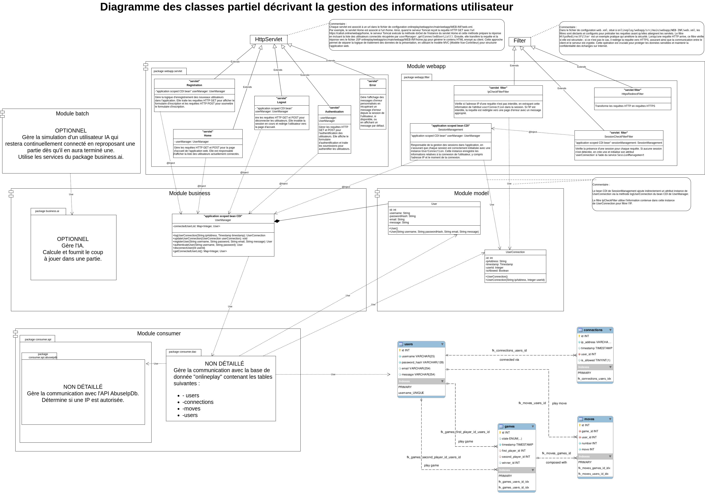
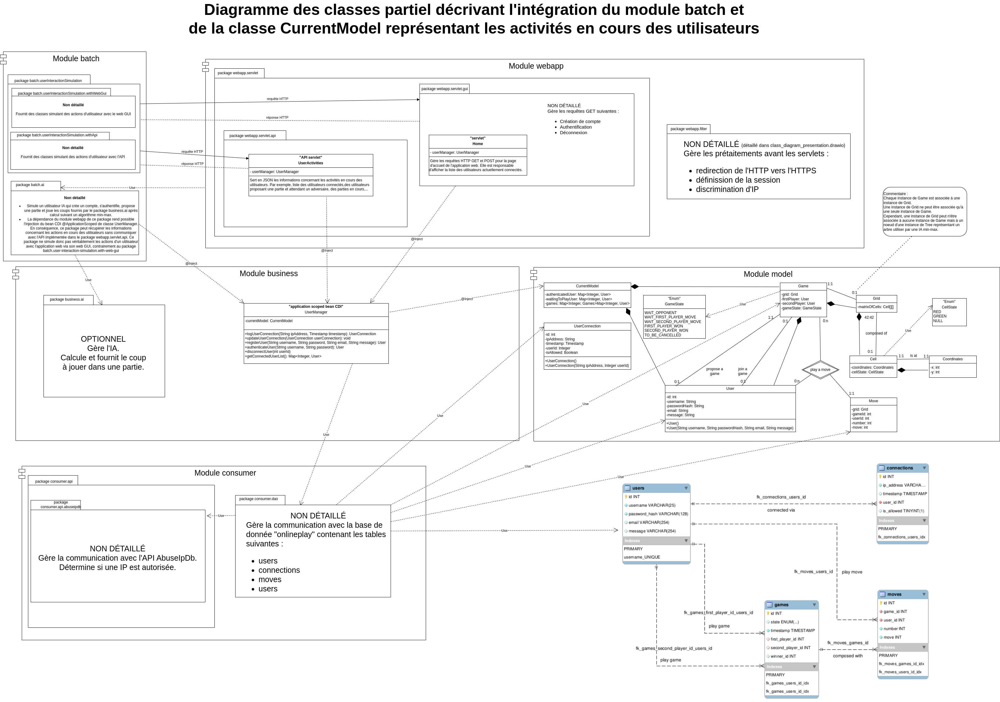
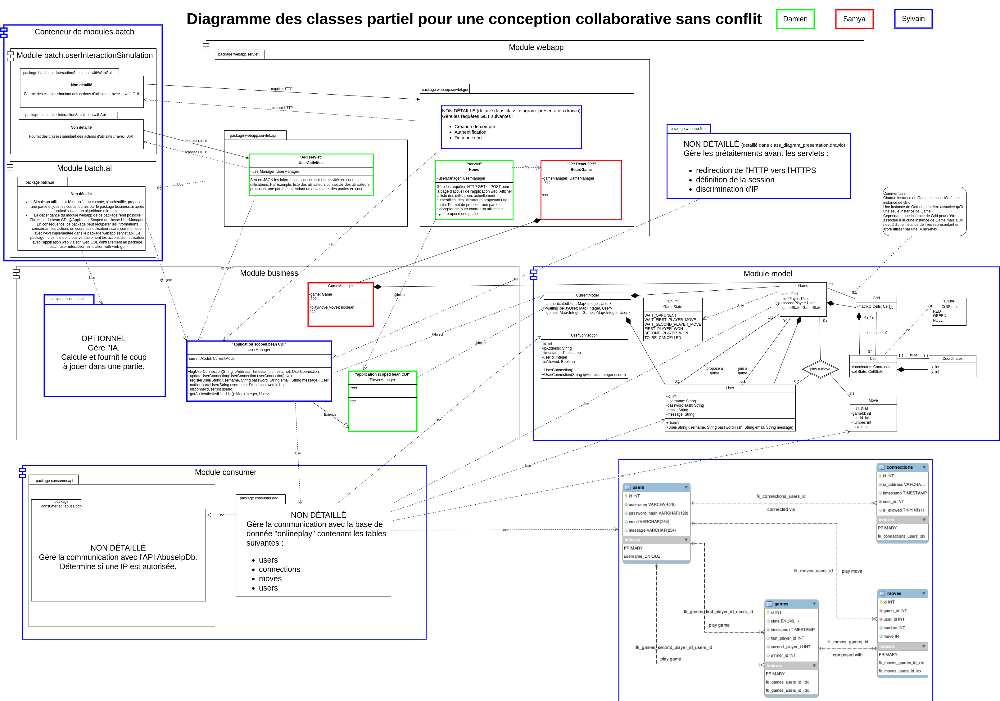
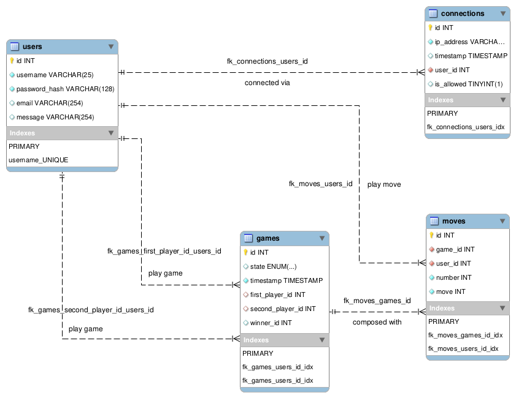
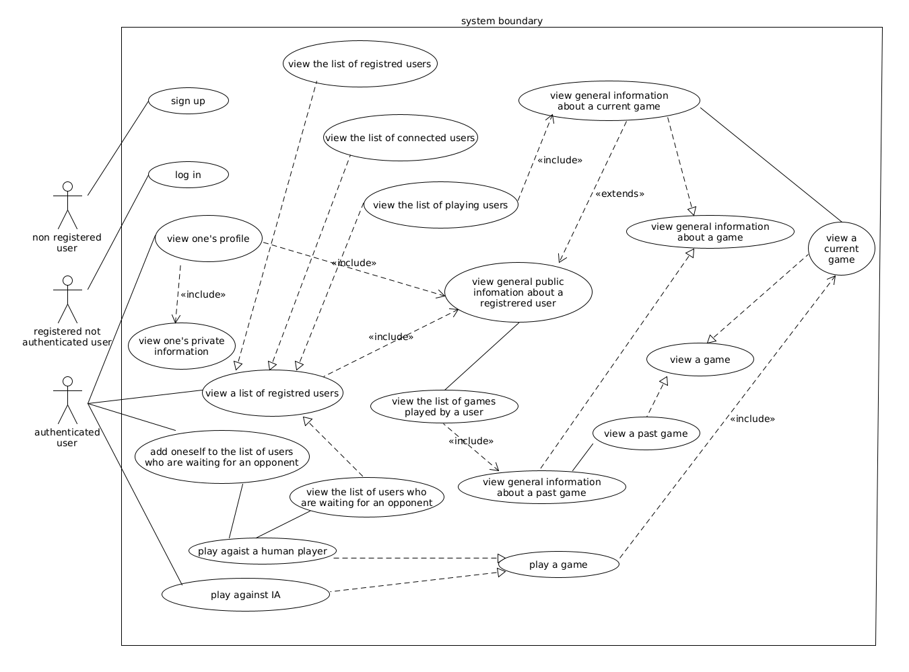
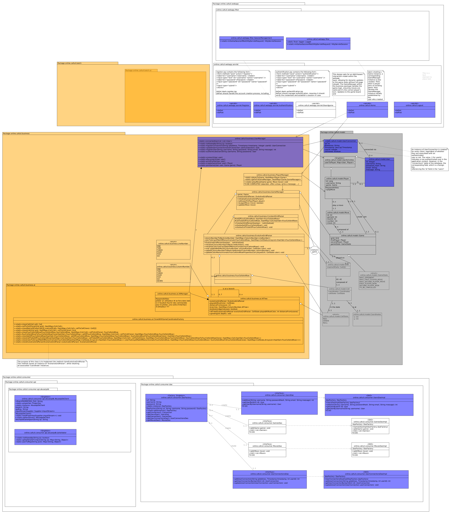

# Quelques diagrammes

## Diagrammes des classes





Dans le développement de notre application web, nous avons abordé deux objectifs
principaux avec le module batch :
- Simuler un joueur IA capable de s'enregistrer, de s'authentifier, de proposer
  une partie d'échecs, et, une fois le défi accepté par un autre utilisateur,
  d'utiliser le sous-package `business.ai` pour déterminer les mouvements à jouer.
- Plus généralement, nous avons envisagé d'implémenter des classes pour simuler
  des actions d'utilisateurs interagissant avec l'interface web, dans le but de
  réaliser des tests fonctionnels approfondis.

Afin de séparer au mieux les responsabilité, de respecter une architecture
multi-tiers traditionnelle et de centraliser l'information des activités en
cours des utilisateurs, nous avons tenté de réaliser simultanément les trois
objectifs suivant :
- Maintenir l'indépendance entre les modules batch et webapp.
- Assurer que batch et webapp dépendent tous deux du module business.
- Permettre l'injection du bean CDI `@ApplicationScoped` de la classe UserManager
  dans chacun des modules batch et webapp afin que les informations concernant
  les activités des utilisateurs puissent être accessible dans le module batch,
  ce bean admettant comme attribut l'unique instance de `CurrentModel` (puisque
  lui même bean CDI `@ApplicationScoped`) contenant toutes ces informations.

Les deux premiers objectifs étaient relativement simples à atteindre de concert.
Cependant, ils rendaient le troisième objectif particulièrement complexe, étant
donné que le bean CDI `@ApplicationScoped` de UserManager est spécifique au
contexte d'exécution de webapp, et donc différent de celui de batch.

Pour contourner cette difficulté, nous avons envisagé des solutions basées sur
des technologies telles que les bases de données partagées ou les systèmes de
cache distribués, offrant une forme de simulation de l'injection du bean dans
batch. Malgré cela, nous avons opté pour une concession significative : rendre
webapp partiellement dépendant de batch. Plus précisément, cette dépendance se
limite au sous-package `batch.ai`, permettant ainsi une interaction directe avec
le bean UserManager pour accéder aux informations sur l'activité des utilisateurs.

Cependant, pour les tests fonctionnels – l'autre aspect crucial de batch – qui
visent à simuler l'interaction réelle des utilisateurs avec l'interface web,
nous avons décidé de séparer ces fonctionnalités dans un sous-module différent
nommé `batch.userInteractionSimulation`. Ce choix garantit que webapp n'est
dépendant que du sous-module de batch nécessaire pour la simulation IA,
minimisant ainsi l'entrelacement entre les modules.

Pour le déclenchement des tâches de batch, nous avons examiné plusieurs
mécanismes :
- Un planificateur de tâches tel que Quartz.
- Une interface d'administration intégrée à webapp.
- Des déclencheurs externes, tels que des scripts shell ou des tâches cron.

Nous avons écarté l'option des déclencheurs externes car ils compromettraient la
capacité d'injecter le bean CDI `@ApplicationScoped` dans batch, limitant notre
accès aux données utilisateur sans passer par des requêtes HTTP directes,
facilitées autrement par une API de webapp que l'on a alors l'idée d'implémenter
dans le sous package `webapp.servlet.api`.

Après avoir mis de côté les déclencheurs externes, nous avons choisi Quartz pour
sa simplicité d'intégration avec notre stack Java et sa capacité à automatiser
les tâches de simulation et de test sans intervention manuelle. Cela nous permet
de maintenir l'indépendance entre le sous-package `batch.userInteractionSimulation`
et webapp tout en gérant efficacement nos besoins en planification.

Cette structure, bien que provisoire, est conçue pour être évolutive. Elle nous
positionne avantageusement pour une future réorganisation qui pourrait voir le
module batch devenir totalement indépendant de webapp, en réimplémentant la
simulation d'un joueur IA pour interagir exclusivement via l'API de webapp.

Nous modifions l'arborescence du projet comme suit :

```plaintext
../onlineplay
├── batch
│   ├── batch.ai
│   │   ├── pom.xml
│   │   └── src
│   │       ├── main
│   │       │   └── java
│   │       │       └── online
│   │       │           └── caltuli
│   │       │               ├── App.java
│   │       │               └── batch
│   │       │                   └── ai
│   │       └── test
│   │           └── java
│   │               └── online
│   │                   └── caltuli
│   │                       └── AppTest.java
│   ├── batch.userInteractionSimulation
│   │   ├── pom.xml
│   │   └── src
│   │       ├── main
│   │       │   └── java
│   │       │       └── online
│   │       │           └── caltuli
│   │       │               ├── App.java
│   │       │               └── batch
│   │       │                   └── userInteractionSimulation
│   │       │                       ├── withApi
│   │       │                       └── withWebGui
│   │       └── test
│   │           └── java
│   │               └── online
│   │                   └── caltuli
│   │                       └── AppTest.java
│   └── pom.xml
├── business
│   ├── [...]
├── consumer
│   ├── [...]
├── model
│   ├── pom.xml
│   ├── src
│   │   ├── main
│   │   │   ├── java
│   │   │   │   └── online
│   │   │   │       └── caltuli
│   │   │   │           └── model
│   │   │   │               ├── Cell.java
│   │   │   │               ├── CellState.java
│   │   │   │               ├── Coordinates.java
│   │   │   │               ├── CurrentModel.java
│   │   │   │               ├── exceptions
│   │   │   │               │   ├── BeanException.java
│   │   │   │               │   ├── user
│   │   │   │               │   │   ├── InvalidMailException.java
│   │   │   │               │   │   ├── InvalidMessageException.java
│   │   │   │               │   │   ├── InvalidPasswordHashException.java
│   │   │   │               │   │   ├── InvalidUsernameException.java
│   │   │   │               │   │   └── UserException.java
│   │   │   │               │   └── userconnection
│   │   │   │               │       └── UserConnectionException.java
│   │   │   │               ├── Game.java
│   │   │   │               ├── GameState.java
│   │   │   │               ├── Grid.java
│   │   │   │               ├── UserConnection.java
│   │   │   │               └── User.java
│   │   │   └── resources
│   │   │       ├── log4j2.properties
│   │   │       └── META-INF
│   │   │           └── beans.xml
│   │   ├── site
│   │   │   ├── [...]
│   └── webapp
│       └── src
│           └── main
│               └── webapp
│                   └── docs
│                       ├── [...]
├── pom.xml
├── README.md
├── src
│   └── site
│       ├── [...]
└── webapp
    ├── pom.xml
    ├── src
    │   ├── main
    │   │   ├── java
    │   │   │   └── online
    │   │   │       └── caltuli
    │   │   │           └── webapp
    │   │   │               ├── filter
    │   │   │               │   ├── HttpsRedirectFilter.java
    │   │   │               │   ├── IPCheckFilter.java
    │   │   │               │   ├── SessionCheckFilter.java
    │   │   │               │   └── SessionManagement.java
    │   │   │               └── servlet
    │   │   │                   ├── api
    │   │   │                   │   └── UserActivities.java
    │   │   │                   └── gui
    │   │   │                       ├── Authentication.java
    │   │   │                       ├── Error.java
    │   │   │                       ├── Home.java
    │   │   │                       ├── Logout.java
    │   │   │                       └── Registration.java
    │   │   ├── resources
    │   │   │   └── log4j2.properties
    │   │   └── webapp
    │   │       ├── index.jsp
    │   │       └── WEB-INF
    │   │           ├── authentication.jsp
    │   │           ├── beans.xml
    │   │           ├── error.jsp
    │   │           ├── home.jsp
    │   │           ├── registration.jsp
    │   │           └── web.xml
    │   ├── site
    │   │   ├── [...]
    └── webapp
        └── src
            └── main
                └── webapp
                    └── docs
                        ├── [...]
```

Avec dans `onlineplay/pom.xml` :

```xml
[...]
  <!-- =============================================================== -->
  <!-- Dependency Management -->
  <!-- =============================================================== -->
  <dependencyManagement>
    <dependencies>
      <!-- ===== Modules ===== -->
      <dependency>
        <groupId>online.caltuli</groupId>
        <artifactId>batch.userInteractionSimulation</artifactId>
        <version>1.0-SNAPSHOT</version>
      </dependency>
      <dependency>
        <groupId>online.caltuli</groupId>
        <artifactId>batch.ai</artifactId>
        <version>1.0-SNAPSHOT</version>
      </dependency>
[...]
```

Dans `onlineplay/batch/pom.xml` :

```xml
<?xml version="1.0" encoding="UTF-8" standalone="no"?>
<project xmlns="http://maven.apache.org/POM/4.0.0" xmlns:xsi="http://www.w3.org/2001/XMLSchema-instance" xsi:schemaLocation="http://maven.apache.org/POM/4.0.0 https://maven.apache.org/xsd/maven-4.0.0.xsd">

    <modelVersion>4.0.0</modelVersion>

    <parent>
        <groupId>online.caltuli</groupId>
        <artifactId>onlineplay</artifactId>
        <version>1.0-SNAPSHOT</version>
    </parent>

    <groupId>online.caltuli</groupId>
    <artifactId>batch</artifactId>
    <version>1.0-SNAPSHOT</version>
    <name>batch</name>
    <packaging>pom</packaging>
    <url>http://maven.apache.org</url>

    <description>
    </description>

    <modules>
        <module>batch.userInteractionSimulation</module>
        <module>batch.ai</module>
    </modules>
</project>
```

Dans `onlineplay/batch/batch.ai/pom.xml` : ...

... je cherche encore, après je travaille sur les interfaces UserManagerInterface et PlayerManagerInterface, puis je reviens sur l'implémentation de batch.userInteractionSimulation afin de simuler des utilisateurs virtuels pour construire des tests fonctionnels.



## Diagramme entité-association



## Diagramme de cas d'utilisation



## Une ébauche de diagramme des classes plus complet


