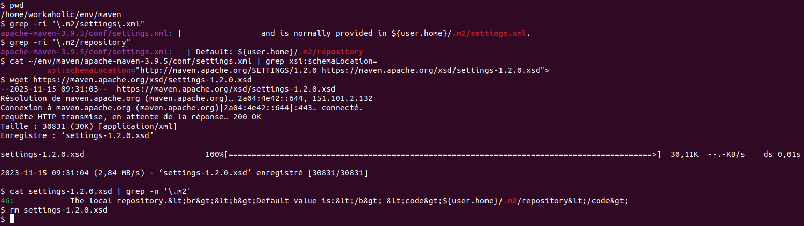

# Construction de l'environnement de développement

## Aperçu de l'arborescence du répertoire de développement

L'organisation du répertoire de développement est structurée comme suit :

```plaintext
/home/workaholic/env
├── current-workspace -> maven/maven-workspace
├── eclipse
│   ├── current -> eclipse-jee-2023-09-R
│   ├── eclipse-jee-2023-09-R
│   │   ├── apache-maven-3.9. -> /home/workaholic/env/maven/apache-maven-3.9.
│   │   ├── [...]
│   │   ├── eclipse-jee-2023-09-R -> /home/workaholic/env/eclipse/eclipse-jee-2023-09-R
│   │   ├── [...]
│   └── eclipse-workspace
│       ├── Servers
│       └── test_DAO
├── env_config
│   ├── bashrc
│   ├── env_config.txt
├── intellij
│   ├── current -> /home/workaholic/env/intellij/idea-IC-232.10227.8
│   ├── idea-IC-232.10227.8
│   │   ├── bin
│   │   ├── build.txt
│   │   ├── Install-Linux-tar.txt
│   │   ├── jbr
│   │   ├── lib
│   │   ├── license
│   │   ├── LICENSE.txt
│   │   ├── NOTICE.txt
│   │   ├── plugins
│   │   └── product-info.json
│   └── intellij-workspace
├── java
│   ├── current -> jdk-21.0.1
│   └── jdk-21.0.1
│       ├── bin
│       ├── conf
│       ├── include
│       ├── jdk-21.0.1 -> /home/workaholic/env/java/jdk-21.0.1
│       ├── jmods
│       ├── legal
│       ├── lib
│       ├── LICENSE -> legal/java.base/LICENSE
│       ├── man
│       ├── README
│       └── release
├── maven
│   ├── apache-maven-3.9.5
│   │   ├── apache-maven-3.9.5 -> /home/workaholic/env/maven/apache-maven-3.9.5
│   │   ├── bin
│   │   ├── boot
│   │   ├── conf
│   │   ├── lib
│   │   ├── LICENSE
│   │   ├── NOTICE
│   │   ├── README.txt
│   │   └── repository
│   ├── current -> apache-maven-3.9.5
│   └── maven-workspace
│       ├── onlineplay
│       ├── test_DAO
│       ├── ticket
│       └── ticket-du-cours-openclassroom
├── sgbdr
│   └── mysql
│       ├── current-client -> /home/workaholic/env/sgbdr/mysql/mysql_8.2.0/usr/bin/mysql
│       ├── current-server -> /home/workaholic/env/sgbdr/mysql/mysql_8.2.0/usr/sbin/mysqld
│       └── mysql_8.2.0
│           ├── data
│           ├── etc
│           ├── lib
│           ├── libmysqlclient22_8.2.0-1ubuntu22.04_amd64.deb
│           ├── libmysqlclient-dev_8.2.0-1ubuntu22.04_amd64.deb
│           ├── mysql-client_8.2.0-1ubuntu22.04_amd64.deb
│           ├── mysql-common_8.2.0-1ubuntu22.04_amd64.deb
│           ├── mysql-community-client_8.2.0-1ubuntu22.04_amd64.deb
│           ├── mysql-community-client-core_8.2.0-1ubuntu22.04_amd64.deb
│           ├── mysql-community-client-plugins_8.2.0-1ubuntu22.04_amd64.deb
│           ├── mysql-community-server_8.2.0-1ubuntu22.04_amd64.deb
│           ├── mysql-community-server-core_8.2.0-1ubuntu22.04_amd64.deb
│           ├── mysql-community-server-debug_8.2.0-1ubuntu22.
│           ├── mysql-community-server-debug_8.2.0-1ubuntu22.04_amd64.deb
│           ├── mysql-community-test_8.2.0-1ubuntu22.04_amd64.deb
│           ├── mysql-community-test-debug_8.2.0-1ubuntu22.04_amd64.deb
│           ├── mysqld.sock
│           ├── mysqld.sock.lock
│           ├── mysql-server_8.2.0-1ubuntu22.04_amd64.deb
│           ├── mysql-testsuite_8.2.0-1ubuntu22.04_amd64.deb
│           └── usr
└── tomcat
    ├── apache-tomcat-10.1.16
    │   ├── bin
    │   │   ├── [...]
    │   │   ├── shutdown.sh
    │   │   ├── startup.sh
    │   │   ├── [...]
    │   ├── BUILDING.txt
    │   ├── conf
    │   ├── CONTRIBUTING.md
    │   ├── lib
    │   ├── LICENSE
    │   ├── logs
    │   ├── NOTICE
    │   ├── README.md
    │   ├── RELEASE-NOTES
    │   ├── RUNNING.txt
    │   ├── temp
    │   ├── webapps
    │   │   ├── [...]
    │   │   └── webapp.war
    │   └── work
    ├── current -> apache-tomcat-10.1.16
    └── var
        └── log
            └── onlineplay.log
```
            

## Instructions pour construire le répertoire de développement

Pour configurer votre environnement de développement, suivez ces étapes :

- **Télécharger et installer le JDK**
  - **Version** : 21.0.1
  - **Page de téléchargement** : [Oracle JDK Downloads](https://www.oracle.com/java/technologies/downloads/)
  - **Archive** : [JDK 21 Linux x64 Compressed Archive](https://download.oracle.com/java/21/latest/jdk-21_linux-x64_bin.tar.gz)
  - **Type** : x64 Compressed Archive for Linux
  - **Vérification de la checksum**
    - **Checksum SHA256** : Consultez le lien pour la checksum : [Checksum SHA256](https://download.oracle.com/java/21/latest/jdk-21_linux-x64_bin.tar.gz.sha256)
    - **Valeur de la checksum SHA256** : `7c1f7689db0f4b48ee6978029c4a1aecd1442a8a7637cdf43a5471d0c79712a8`
    - **Commande de vérification** :
      ```sh
      sha256sum ../env/java/jdk-21_linux-x64_bin.tar.gz
      ```
  - **Répertoire de téléchargement** : `env/java/`
  - **Décompression de l'archive** :
    ```sh
    tar -xzvf ../env/java/jdk-21_linux-x64_bin.tar.gz -C ../env/java/jdk-21.0.1/
    rm ../env/java/jdk-21_linux-x64_bin.tar.gz
    ```
  - **Initialisation de la version du JDK utilisée** :
    ```sh
    ln -s ~/env/java/jdk-21.0.1 ~/env/java/current
    ```
- **Télécharger et installer Apache Maven**
    - **Version** : 3.9.5
    - **Page de téléchargement** : [Apache Maven Download](https://maven.apache.org/download.cgi)
    - **Archive** : [Apache Maven 3.9.5 Binary tar.gz](https://dlcdn.apache.org/maven/maven-3/3.9.5/binaries/apache-maven-3.9.5-bin.tar.gz)
    - **Type** : Binary tar.gz archive
    - **Vérification de la checksum**
        - **Checksum SHA512** : [Checksum SHA512](https://downloads.apache.org/maven/maven-3/3.9.5/binaries/apache-maven-3.9.5-bin.tar.gz.sha512)
        - **Valeur de la checksum SHA512** :
          ```
          4810523ba025104106567d8a15a8aa19db35068c8c8be19e30b219a1d7e83bcab96124bf86dc424b1cd3c5edba25d69ec0b31751c136f88975d15406cab3842b
          ```
        - **Signature** : [Apache Maven Signature](https://downloads.apache.org/maven/maven-3/3.9.5/binaries/apache-maven-3.9.5-bin.tar.gz.asc)
        - **Commande de vérification** :
          ```sh
          sha512sum ../env/maven/apache-maven-3.9.5-bin.tar.gz
          ```
    - **Répertoire de téléchargement** : `env/maven/`
    - **Décompression de l'archive** :
      ```sh
      tar -xzvf ../env/maven/apache-maven-3.9.5-bin.tar.gz -C ../env/maven/
      rm ../env/maven/apache-maven-3.9.5-bin.tar.gz
      ```
    - **Initialisation de la version de Apache Maven utilisée** :
      ```sh
      ln -s ~/env/maven/apache-maven-3.9.5 ~/env/maven/current
      ```
- **Définir des variables d'environnement relatives à Java et à Apache Maven**
    - **Pourquoi** : Pour permettre au système de trouver les exécutables de Java et
      Apache Maven dans les répertoires où ils ont été installés.
    - **Ajout dans `.bashrc`** : Ajoutez les lignes suivantes à la fin de votre fichier
      `~/.bashrc` pour configurer les variables d'environnement :
      ```sh
      # Development directory ~/env/ configuration
      # Java
      export JAVA_HOME="/home/workaholic/env/java/jdk-21.0.1"
      export MAVEN_HOME="/home/workaholic/env/maven/apache-maven-3.9.5"
      export PATH="$JAVA_HOME/bin:$MAVEN_HOME/bin:$PATH"
      ```
    - **Explication** : Le fichier `~/.bashrc` est exécuté par toutes les sessions du shell
      pour se configurer au démarrage, appliquant ainsi les configurations au niveau de
      l'utilisateur actuel.
    - **Vérification** : Pour vérifier que les variables d'environnement ont été correctement
      définies, ouvrez une nouvelle session du shell et exécutez :
      ```sh
      java -version
      mvn -v
      ```
- **Configurer Apache Maven**
    - Lors de la première utilisation d'une commande Maven qui nécessite la résolution
      de dépendances (exemple : `mvn help:help`), Maven crée le dossier `.m2/` et se
      configure via `~/env/maven/apache-maven-3.9.5/conf/settings.xml`. Cela inclut la
      création du répertoire local `.m2/`, conformément au schéma défini dans
      [settings-1.2.0.xsd](https://maven.apache.org/xsd/settings-1.2.0.xsd).
    - **Preuve** :
      Pour voir comment Maven utilise et définit le répertoire local `.m2/` :
      ```sh
      cd ~/env/maven
      grep -ri ".m2/settings.xml"
      grep -ri ".m2/repository"
      cat ~/env/maven/apache-maven-3.9.5/conf/settings.xml | grep xsi:schemaLocation=
      wget https://maven.apache.org/xsd/settings-1.2.0.xsd
      cat settings-1.2.0.xsd | grep -n '.m2'
      rm settings-1.2.0.xsd
      ```
      

    - **Création du fichier de configuration optionnel de Maven `~/.m2/settings.xml`** pour
      personnalisation, en copiant d'abord le fichier de configuration par défaut :
      ```sh
      cp ~/env/maven/apache-maven-3.9.5/conf/settings.xml ~/.m2/
      ```
    - **Modification du répertoire de dépôt local `.m2/repository` pour Maven** :
        - Créer un répertoire de dépôt local dans le répertoire de développement :
          ```sh
          mkdir ~/env/maven/repository
          ```
        - Configurer l'emplacement du nouveau répertoire de dépôt local en modifiant
          `~/.m2/settings.xml` pour utiliser `~/env/maven/apache-maven-3.9.5/repository` :
          ```xml
          <localRepository>${user.home}/env/maven/repository</localRepository>
          ```
        - Après exécution de `mvn help:help`, Maven utilisera ce nouveau répertoire pour
          stocker les dépendances.

- **Télécharger Eclipse**
    - **Version** : Eclipse for JEE developers de la révision de septembre 2023
      ("2023-09-R")
    - **URL de la page de téléchargement** :
      [eclipse-jee-2023-09-R-linux-gtk-x86\_64.tar.gz](http://www.eclipse.org/downloads/download.php?file=/technology/epp/downloads/release/2023-09/R/eclipse-jee-2023-09-R-linux-gtk-x86_64.tar.gz)
    - **URL de l'archive** :
      [eclipse-jee-2023-09-R-linux-gtk-x86\_64.tar.gz avec ID miroir](https://www.eclipse.org/downloads/download.php?file=/technology/epp/downloads/release/2023-09/R/eclipse-jee-2023-09-R-linux-gtk-x86_64.tar.gz&mirror_id=1045)
    - **Type** : x64-Compressed Archive for Linux
    - **Vérification de la checksum**
        - **Lien de la checksum 512** :
          [Checksum SHA512](https://www.eclipse.org/downloads/download.php?file=/technology/epp/downloads/release/2023-09/R/eclipse-jee-2023-09-R-linux-gtk-x86_64.tar.gz#btn-ajax-checksum-sha512)
        - **Checksum SHA512** :
          `46d02838283b2f84b26b5d2a39c223f14c88a9cae1e22a77666db78664dc292dc3482e3f68fd4fa77fcdc9f18b40e52c366d57aad1929ac03a26684842a565bc`
        - **Commande de vérification** :
          ```sh
          sha512sum ../env/eclipse/eclipse-jee-2023-09-R-linux-gtk-x86_64.tar.gz
          ```
    - **Répertoire de téléchargement** : `env/eclipse/`
    - **Décompression** :
      ```sh
      tar -xzvf ../env/eclipse/eclipse-jee-2023-09-R-linux-gtk-x86_64.tar.gz -C ../env/eclipse/
      rm ../env/eclipse/eclipse-jee-2023-09-R-linux-gtk-x86_64.tar.gz
      ```
    - **Initialisation de la version de Eclipse** :
      ```sh
      ln -s ~/env/eclipse/eclipse-jee-2023-09-R ~/env/eclipse/current
      ```

- **Télécharger IntelliJ**
    - **Version** : ideaIC-2023.2.5
    - **URL de la page de téléchargement** :
      [IntelliJ IDEA Download](https://www.jetbrains.com/idea/download/?section=linux)
    - **URL de l'archive** :
      [IntelliJ IDEA Linux Archive](https://www.jetbrains.com/idea/download/download-thanks.html?platform=linux&code=IIC)
    - **Type** : x64-Compressed Archive for Linux
    - **Vérification de la checksum**
        - **Lien de la checksum 256** :
          [Checksum SHA256](https://download.jetbrains.com/idea/ideaIC-2023.2.5.tar.gz.sha256)
        - **Checksum SHA256** :
          `4fc5817f8bfd86bdb3af924d3ca32e349517710ac5f986ae20f765f79285e00b`
        - **Commande de vérification** :
          ```sh
          sha256sum ../env/intellij/ideaIC-2023.2.5.tar.gz
          ```
    - **Répertoire de téléchargement** : `env/intellij`
    - **Décompression** :
      ```sh
      tar -xzvf ../env/intellij/ideaIC-2023.2.5.tar.gz -C ../env/intellij/
      rm ../env/intellij/ideaIC-2023.2.5.tar.gz
      ```
    - **Initialisation de la version de IntelliJ** :
      ```sh
      ln -s ~/env/intellij/idea-IC-232.10227.8 ~/env/intellij/current
      ```

- **Télécharger Tomcat**
    - **Version** : 10.1.16
    - **URL de la page de téléchargement** :
      [https://tomcat.apache.org/download-10.cgi](https://tomcat.apache.org/download-10.cgi)
    - **URL de l'archive** :
      [apache-tomcat-10.1.16.tar.gz](https://dlcdn.apache.org/tomcat/tomcat-10/v10.1.16/bin/apache-tomcat-10.1.16.tar.gz)
    - **Type** : Binary tar.gz archive
    - **Vérification de la checksum**
        - **Lien de la checksum SHA512** :
          [Checksum SHA512](https://downloads.apache.org/tomcat/tomcat-10/v10.1.16/bin/apache-tomcat-10.1.16.tar.gz.sha512)
        - **Checksum SHA512** :
          `d469d0c68cf5e321bbc264c3148d28899e320942f34636e0aff3d79fc43e8472cd0420d0d3df5ef6ece4be4810a3f8fd518f605c5a9c13cac4e8f96f5f138e92`
        - **Lien de la signature** :
          [Signature PGP](https://downloads.apache.org/tomcat/tomcat-10/v10.1.16/bin/apache-tomcat-10.1.16.tar.gz.asc)
        - **Commande de vérification** :
          ```sh
          sha512sum ../env/tomcat/apache-tomcat-10.1.16.tar.gz
          ```
    - **Répertoire de téléchargement** : `env/tomcat/`
    - **Décompression** :
      ```sh
      tar -xzvf ../env/tomcat/apache-tomcat-10.1.16.tar.gz -C ../env/tomcat/
      rm ../env/tomcat/apache-tomcat-10.1.16.tar.gz
      ```
    - **Initialisation de la version de Tomcat** :
      ```sh
      ln -s ~/env/tomcat/apache-tomcat-10.1.16 ~/env/tomcat/current
      ```

- **Télécharger le serveur et le client MySQL**
    - **Version** : 8.2.0
    - **Nom de l'archive** : mysql-server_8.2.0-1ubuntu22.04_amd64.deb-bundle
    - **URL de la page de téléchargement** :
      [https://dev.mysql.com/downloads/mysql/](https://dev.mysql.com/downloads/mysql/)
    - **URL de l'archive** :
      [mysql-server_8.2.0-1ubuntu22.04_amd64.deb-bundle.tar](https://dev.mysql.com/get/Downloads/MySQL-8.2/mysql-server_8.2.0-1ubuntu22.04_amd64.deb-bundle.tar)
    - **Type** : POSIX tar archive (GNU)
    - **Vérification de la checksum**
        - **Lien de la checksum MD5** :
          [Checksum MD5](https://dev.mysql.com/downloads/mysql/)
        - **Checksum MD5** : `dcdc37b9fb24352c5355a87dbbb8471d`
        - **Lien de la signature** :
          [Signature PGP](https://dev.mysql.com/downloads/gpg/?file=mysql-server_8.2.0-1ubuntu22.04_amd64.deb-bundle.tar&p=23)
        - **Commande de vérification** :
          ```sh
          md5sum ../env/sgbdr/mysql/mysql-server_8.2.0-1ubuntu22.04_amd64.deb-bundle.tar
          ```
    - **Répertoire de téléchargement** : `env/sgbdr/mysql/mysql_8.2.0/`
    - **Décompression** :
      ```sh
      tar -xvf ../env/sgbdr/mysql/mysql_8.2.0/mysql-server_8.2.0-1ubuntu22.04_amd64.deb-bundle.tar -C ../env/sgbdr/mysql/mysql_8.2.0/
      rm ../env/sgbdr/mysql/mysql_8.2.0/mysql-server_8.2.0-1ubuntu22.04_amd64.deb-bundle.tar
      ```
    - **Liste des paquets téléchargés** :
        - libmysqlclient22_8.2.0-1ubuntu22.04_amd64.deb
        - libmysqlclient-dev_8.2.0-1ubuntu22.04_amd64.deb
        - mysql-client_8.2.0-1ubuntu22.04_amd64.deb
        - (et ainsi de suite pour les autres paquets)
    - **Extraction des fichiers .deb dans le répertoire de développement** :
      ```sh
      dpkg-deb -x ../env/sgbdr/mysql/mysql_8.2.0/mysql-common_8.2.0-1ubuntu22.04_amd64.deb /home/workaholic/env/sgbdr/mysql/mysql_8.2.0/
      dpkg-deb -x ../env/sgbdr/mysql/mysql_8.2.0/mysql-community-client_8.2.0-1ubuntu22.04_amd64.deb /home/workaholic/env/sgbdr/mysql/mysql_8.2.0/
      dpkg-deb -x ../env/sgbdr/mysql/mysql_8.2.0/mysql-community-server_8.2.0-1ubuntu22.04_amd64.deb /home/workaholic/env/sgbdr/mysql/mysql_8.2.0/
      dpkg-deb -x ../env/sgbdr/mysql/mysql_8.2.0/mysql-community-server-core_8.2.0-1ubuntu22.04_amd64.deb /home/workaholic/env/sgbdr/mysql/mysql_8.2.0/
      dpkg-deb -x ../env/sgbdr/mysql/mysql_8.2.0/mysql-community-client-core_8.2.0-1ubuntu22.04_amd64.deb /home/workaholic/env/sgbdr/mysql/mysql_8.2.0/
      ```

- **Installation, configuration et exécution du serveur `mysqld` et du client `mysql`**
    - **Configuration** : Configurez `mysqld` en ajoutant les paramètres suivants
      au fichier de configuration `mysql.cnf` :
      ```sh
      cat >> ~/env/sgbdr/mysql/mysql_8.2.0/etc/mysql/conf.d/mysql.cnf << EOF
      [mysqld]
      port = 3307
      socket = /home/workaholic/env/sgbdr/mysql/mysql_8.2.0/mysqld.sock
      datadir = /home/workaholic/env/sgbdr/mysql/mysql_8.2.0/data
      log_error = /home/workaholic/env/sgbdr/mysql/mysql_8.2.0/data/mysql-error.log
      EOF
      $HOME/env/sgbdr/mysql/mysql_8.2.0/usr/sbin/mysqld \
      --defaults-file=/home/workaholic/env/sgbdr/mysql/mysql_8.2.0/etc/mysql/conf.d/mysql.cnf \
      --initialize \
      --datadir=/home/workaholic/env/sgbdr/mysql/mysql_8.2.0/data
      ```
    - **Exécution du serveur en arrière-plan** : Configurez le démarrage de `mysqld`
      en arrière-plan dans le fichier `.bashrc` :
      ```sh
      if ! pgrep -f "$HOME/env/sgbdr/mysql/mysql_8.2.0/usr/sbin/mysqld" > /dev/null
      then
          $HOME/env/sgbdr/mysql/mysql_8.2.0/usr/sbin/mysqld \
          --defaults-file=$HOME/env/sgbdr/mysql/mysql_8.2.0/etc/mysql/conf.d/mysql.cnf \
          --daemonize
      fi
      ```
    - **Initialisation de la version de MySQL** : Créez des liens symboliques pour
      utiliser facilement les exécutables `mysqld` et `mysql` :
      ```sh
      ln -s ~/env/sgbdr/mysql/mysql_8.2.0/usr/sbin/mysqld ~/env/sgbdr/mysql/current-server
      ln -s ~/env/sgbdr/mysql/mysql_8.2.0/usr/bin/mysql ~/env/sgbdr/mysql/current-client
      ```
    - **Vérification et configuration du mot de passe root** : Changez le mot de passe
      root initial pour sécuriser votre installation MySQL :
      ```sh
      # récupération du mot de passe root provisoire
      cat ~/env/sgbdr/mysql/mysql_8.2.0/data/mysql-error.log | grep password
      # connection en tant que root via le client du répertoire de développement
      ../env/sgbdr/mysql/current-client -u root -p -h 127.0.0.1 -P 3307
      ALTER USER 'root'@'localhost' IDENTIFIED BY <mot de passe choisi pour root>;
      # terminer l'exécution du client mysql
      quit;
      ```

- **Définir des variables d'environnement relatives à Tomcat**
    - **Pourquoi** : Les variables d'environnement sont nécessaires pour que le
      système sache où trouver les fichiers de configuration, les bibliothèques, et
      autres ressources nécessaires pour exécuter la version de Tomcat choisie.
    - **Ajout dans `.bashrc`** : Ajoutez les lignes suivantes à la fin du fichier
      `~/.bashrc` pour configurer `CATALINA_HOME` :
      ```sh
      # Développement Tomcat - Configuration du répertoire
      export CATALINA_HOME="/home/workaholic/env/tomcat/current"
      ```
    - **Explication** : Le fichier `~/.bashrc` est exécuté par chaque session shell
      pour configurer l'environnement de l'utilisateur. La définition de
      `CATALINA_HOME` permet au système et aux applications de localiser les
      ressources nécessaires de Tomcat.

- **Configurer Eclipse pour utiliser jdk-21.0.1 et tomcat-10.1.16**
    - **Configuration du serveur Tomcat** :
        1. Aller dans `Window → Preferences → Server → Runtime Environments → Add`.
        2. Sélectionnez `Apache → Apache Tomcat v10.1`.
        3. Nommez-le `Apache Tomcat v10.1.16`.
        4. Définissez le répertoire d'installation de Tomcat à
           `/home/workaholic/env/tomcat/apache-tomcat-10.1.16`.
        5. Choisissez le JRE `jdk-21.0.1`.
        6. Cliquez sur `Apply and Close`.
    - **Ajout de la bibliothèque Java EE** :
        1. Faites un clic droit sur le projet dans Eclipse.
        2. Choisissez `Properties → Java Build Path → Libraries → Add Library`.
        3. Sélectionnez `Server Runtime`, puis `Next`.
        4. Choisissez `Apache Tomcat v10.1.16`, puis `Finish`.

- **Configurer IntelliJ pour utiliser la version courante du JDK**
    - Allez dans `File → Project Structure... → SDKs`.
    - Nommez le SDK `current-jdk`.
    - Spécifiez le chemin du JDK à `/home/workaholic/env/java/current`.
    - Appliquez avec `Apply` puis validez avec `OK`.

- **Mettre à jour Eclipse JEE 2023-09-R**
    - Utilisez `Help → Check for Updates` pour lancer la recherche et l'installation
      des mises à jour disponibles.

- **Configurer Eclipse pour utiliser Apache Maven**
    - **Plugin Maven** : Sur les versions d'Eclipse fournies par les packages
      "Eclipse IDE for Java EE Developers" ou "Eclipse IDE for Java Developers",
      le plugin de support Maven est déjà inclus.
    - **URL de téléchargement** : Pour plus d'informations ou des mises à jour,
      consultez [https://eclipse.dev/m2e/](https://eclipse.dev/m2e/).
    - **Ajouter une installation de Maven** :
        1. Allez dans `Window → Preferences → Maven → Installations → Add`.
        2. Saisissez le répertoire d'installation de Maven à `~/env/maven/current`
           pour le champ `Installation home`.
        3. Nommez l'installation `current-maven`.
        4. Cliquez sur `Finish`.
        5. Cochez `current-maven` pour l'utiliser.
        6. Dans `User Settings`, spécifiez le chemin vers le fichier de configuration
           Maven à `${user.home}/.m2/settings.xml`.
        7. Cliquez sur `Update Settings`.
        8. Appliquez les modifications avec `Apply and Close`.
